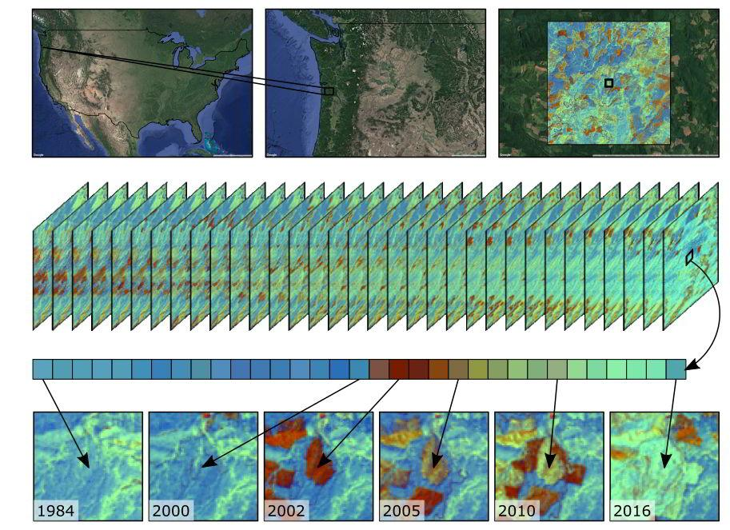
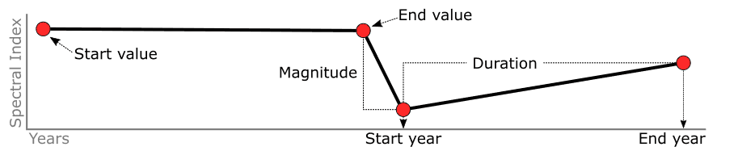

# About
{:.no_toc}

## Table of contents
{:.no_toc .text-delta}

* TOC
{:toc}

This document describes a method to generate geospatial polygons of annual landscape change for a given region of Earth. Change is identified from an annual series of Landsat images whose spectral history is segmented and queried for durable change. Spectral-temporal segmentation is performed by the LandTrendr () algorithm. Raster-based change information is generated in Google Earth Engine, which is then downloaded to a local computer for further processing in Python to filter change of interest and convert raster data to polygon data. Polygons representing discrete patches of change occurring at an annual time step are aggregated into a large database and attributed with characteristics describing the start and end years of the change as well as spectral properties that can aid in automatically identifying change agents and for generating descriptive statistics that describe patterns and trends of change.

## LandTrendr

Each pixel in an image time series has a story to tell, LandTrendr aims to tell them succinctly. Let’s look at an example; here we have a pixel intersecting Lon: -123.845, Lat: 45.889 from a conifer-dominated, industrial forest region of the Pacific Northwest, USA. At the beginning of its record, it was a mature, second-growth conifer stand, and for 17 years, little changed. Then, between the summers of 2000 and 2001 a service road was built through it, removing some of its vegetation. Over the next year it experienced a clearcut harvest, removing all of its remaining vegetation. For the last 14 years it has been regenerating. Most recently it was a closed canopy, maturing, conifer stand.

*Every pixel tells a story. Landsat provides a historical record of the character of landscapes. By extracting a single pixel from a time series of Landsat imagery, it is possible to recount the state and change of the features composing the 1-hectare area of a pixel through time. In this example, we analyze the history of a conifer forest pixel from an industrial forest region of the Pacific Northwest (USA) that experiences a period of relative stability, a dramatic, rapid loss of vegetation, and subsequent regeneration.* 

The description of this example pixel’s history is of course abridged, and only conveys a moderate resolution perspective of state and change in forest character. The unabridged version of this pixel’s story includes many other small changes in the forest stand it represents, but given the precision of the satellite sensor and methods in processing, the provided description is the type of pixel history interpretation we are confident are represented well in the image time series. LandTrendr is a brevity algorithm that listens to the annual, verbose, noisy detail of a pixel’s story and writes an abridged version.

In practice, LandTrendr takes a single point-of-view from a pixel’s spectral history, like a band or an index, and goes through a process to identify breakpoints separating periods of durable change or stability in spectral trajectory, and records the year that changes occurred. These breakpoints, defined by year and spectral index value, allow us to represent the spectral history of a pixel as a series of vertices bounding line segments.

*LandTrendr pixel time series segmentation. Image data is reduced to a single band or spectral index and then divided into a series of straight line segments by breakpoint (vertex) identification.*

There are two neat features that result from this segmented view of spectral history.

1. The ability to interpolate new values for years between vertices.

2. Simple geometry calculations on line segments provide information about distinct spectral epochs

The ability to interpolate new values for years between vertices is very useful. It ensures that each observation is aligned to a trajectory consistent with where the pixel has been and where it is going. We can think of this as hindsight-enhanced image time series data. It has two practical utilities. It can fill in data from missing observations in the time series (masked because of cloud or shadow) and it maintains consistency in predictive mapping through time; e.g. an annual forest classification is not likely to bounce between mature and old-growth conifer because of minor differences in spectral reflectance from atmosphere or shadow difference.

*Hindsight-enhanced image time series data. Identification of time series breakpoints or vertices, allows the observations between vertices to be interpolated, removing extraneous information and placing each observation in the context of the trajectory it is part of. This is useful in filling missing observations because of cloud and shadow, and makes for more consistent annual map prediction. *

Since breakpoints or vertices are defined by a year we also have the ability to impose breakpoints identified in one spectral band or index on any other. For instance, we can segment a pixel time series cast as Normalized Burn Ratio (NBR: [NIR-SWIR]/[NIR+SWIR]) to identify vertices, and then segment a short-wave infrared (SWIR) band based on the NBR-identified vertices.

*Impose the segmentation structure of one spectral representation on another. Here we have identified four breakpoints or vertices for a pixel time series using NBR, and then used the year of those vertices to segment and interpolate the values of a SWIR band time series for the same pixel.* 

This is useful because we can make the whole data space for a pixel’s time series consistent relative to a single perspective and summarize starting, ending, and delta values for all spectral representations for the same temporal segments, which can be powerful predictors of land cover, agent of change, and state transitions.

*A stack of spectral representations can be standardized to the segmentation structure of a single spectral band or index. Here we are demonstrating the standardization of tasseled cap brightness, greenness, and wetness to the segmentation structure of NBR. This allows us to take advantage of multi-dimensional spectral space to describe the properties of spectral epochs and breakpoints to predict land cover, change process, and transitions from a consistent perspective (NBR).* 

The second neat feature of a segmented world view of spectral history is that simple geometry calculations can summarize attributes of spectral epochs. Temporal duration and spectral magnitude can be calculated for each segment based on the vertex time and spectral dimensions. These attributes allow us to easily query the data about when changes occur, how frequently they occur, on average how long do they last, what is the average magnitude of disturbance (or recovery) segments, etc. We can also query information about adjacent segments to focal segments. For instance, we can ask, what it the average rate of recovery following a disturbance segment, or what was the trajectory of a pixel time series prior to disturbance segments that we’ve attributed to fire.

*Diagram of segment attributes. From these attributes we can summarize and query change per pixel over the landscape. *

add

## LandTrendr Preprocessing

LandTrendr segmentation and fitted spectral time series data are produced using the Google Earth Engine implementation of the LandTrendr spectral-temporal segmentation algorithm. For a given region, a collection of USGS surface reflectance images for user-defined annual date range is assembled. The collection includes images from TM, ETM+, and OLI sensors. Each image in the collection is optionally masked to exclude clouds, cloud shadows, snow, and water using the CFMASK algorithm, which is provided with the surface reflectance product. Additionally, OLI image bands 2, 3, 4, 5, 6 and 7 are transformed to the spectral properties of ETM+ bands 1, 2, 3, 4, 5 and 7, respectively, using slopes and intercepts from reduced major axis regressions reported in Table 2 of Roy et al, (year).

Transforming OLI data to match ETM+ data permits inter-sensor compositing to reduce multiple observations per year to a single annual spectral value, which is a requirement of the LandTrendr algorithm. To calculate composites, a medoid approach is used: for a given image pixel, the medoid is the value for a given band that is numerically closest to the median of all corresponding pixels among images considered.

Medoid compositing is performed for each year in the collection and includes images from any sensor contributing to the annual set of seasonal observations for the year being processed. The result is a single multi-band image, per year, free of clouds and cloud shadows, and represents median user-defined season surface reflectance. From these annual medoid composites, a selected spectral index or band is calculated and provided as the time series input to the LandTrendr algorithm.
