LT Annual Change Guide

# Contents

* [About](https://docs.google.com/document/d/1MuYjttWOZvqWPAz2BQvr6IPE7N4r9dxW2PuKJoSpxe4/edit#heading=h.61j8dohkpug)

* [Directory Setup](#heading=h.7k7uc2kddhr9)

* [LandTrendrPyEnv](https://docs.google.com/document/d/1MuYjttWOZvqWPAz2BQvr6IPE7N4r9dxW2PuKJoSpxe4/edit#heading=h.m30ebp1mx1qh)

* [Scripts](#heading=h.uhvy98ob08hs)

* [Project Setup](#heading=h.qtiyguaspsr0)

* [Dependency Check](#heading=h.kabctpcbful9)

* [Vector Setup](#heading=h.7ncjbx4zupdj)

* [Google Earth Engine Setup](#heading=h.xxgvkcmemabl)

* [Vector Upload to Google Earth Engine](#heading=h.v7dbl7hanw9i)

* [LandTrendr Parameter Testing](#heading=h.2nq3z2vsrp42)

* [Generate LandTrendr Data](#heading=h.g3e27kuxp3i2)

* [Download LandTrendr Data from Google Drive](#heading=h.1izzmbv5ibvh)

* [Generate Annual Change Polygons](#heading=h.ma0w94gc6ujw)

* [SQL Queries](#heading=h.e62suex70azt)

* [Appendix](#heading=h.lgt2q590e10r)

# About

This document describes a method to generate geospatial polygons of annual landscape change for a given region of Earth. Change is identified from an annual series of Landsat images whose spectral history is segmented and queried for durable change. Spectral-temporal segmentation is performed by the LandTrendr () algorithm. Raster-based change information is generated in Google Earth Engine, which is then downloaded to a local computer for further processing in Python to filter change of interest and convert raster data to polygon data. Polygons representing discrete patches of change occurring at an annual time step are aggregated into a large database and attributed with characteristics describing the start and end years of the change as well as spectral properties that can aid in automatically identifying change agents and for generating descriptive statistics that describe patterns and trends of change.

## LandTrendr

Each pixel in an image time series has a story to tell, LandTrendr aims to tell them succinctly. Let’s look at an example; here we have a pixel intersecting Lon: -123.845, Lat: 45.889 from a conifer-dominated, industrial forest region of the Pacific Northwest, USA. At the beginning of its record, it was a mature, second-growth conifer stand, and for 17 years, little changed. Then, between the summers of 2000 and 2001 a service road was built through it, removing some of its vegetation. Over the next year it experienced a clearcut harvest, removing all of its remaining vegetation. For the last 14 years it has been regenerating. Most recently it was a closed canopy, maturing, conifer stand.

*Every pixel tells a story. Landsat provides a historical record of the character of landscapes. By extracting a single pixel from a time series of Landsat imagery, it is possible to recount the state and change of the features composing the 1-hectare area of a pixel through time. In this example, we analyze the history of a conifer forest pixel from an industrial forest region of the Pacific Northwest (USA) that experiences a period of relative stability, a dramatic, rapid loss of vegetation, and subsequent regeneration.* 

The description of this example pixel’s history is of course abridged, and only conveys a moderate resolution perspective of state and change in forest character. The unabridged version of this pixel’s story includes many other small changes in the forest stand it represents, but given the precision of the satellite sensor and methods in processing, the provided description is the type of pixel history interpretation we are confident are represented well in the image time series. LandTrendr is a brevity algorithm that listens to the annual, verbose, noisy detail of a pixel’s story and writes an abridged version.

In practice, LandTrendr takes a single point-of-view from a pixel’s spectral history, like a band or an index, and goes through a process to identify breakpoints separating periods of durable change or stability in spectral trajectory, and records the year that changes occurred. These breakpoints, defined by year and spectral index value, allow us to represent the spectral history of a pixel as a series of vertices bounding line segments.

*LandTrendr pixel time series segmentation. Image data is reduced to a single band or spectral index and then divided into a series of straight line segments by breakpoint (vertex) identification.*

There are two neat features that result from this segmented view of spectral history.

1. The ability to interpolate new values for years between vertices.

2. Simple geometry calculations on line segments provide information about distinct spectral epochs

The ability to interpolate new values for years between vertices is very useful. It ensures that each observation is aligned to a trajectory consistent with where the pixel has been and where it is going. We can think of this as hindsight-enhanced image time series data. It has two practical utilities. It can fill in data from missing observations in the time series (masked because of cloud or shadow) and it maintains consistency in predictive mapping through time; e.g. an annual forest classification is not likely to bounce between mature and old-growth conifer because of minor differences in spectral reflectance from atmosphere or shadow difference.

*Hindsight-enhanced image time series data. Identification of time series breakpoints or vertices, allows the observations between vertices to be interpolated, removing extraneous information and placing each observation in the context of the trajectory it is part of. This is useful in filling missing observations because of cloud and shadow, and makes for more consistent annual map prediction. *

Since breakpoints or vertices are defined by a year we also have the ability to impose breakpoints identified in one spectral band or index on any other. For instance, we can segment a pixel time series cast as Normalized Burn Ratio (NBR: [NIR-SWIR]/[NIR+SWIR]) to identify vertices, and then segment a short-wave infrared (SWIR) band based on the NBR-identified vertices.

*Impose the segmentation structure of one spectral representation on another. Here we have identified four breakpoints or vertices for a pixel time series using NBR, and then used the year of those vertices to segment and interpolate the values of a SWIR band time series for the same pixel.* 

This is useful because we can make the whole data space for a pixel’s time series consistent relative to a single perspective and summarize starting, ending, and delta values for all spectral representations for the same temporal segments, which can be powerful predictors of land cover, agent of change, and state transitions.

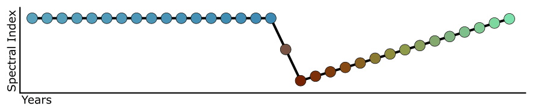

*A stack of spectral representations can be standardized to the segmentation structure of a single spectral band or index. Here we are demonstrating the standardization of tasseled cap brightness, greenness, and wetness to the segmentation structure of NBR. This allows us to take advantage of multi-dimensional spectral space to describe the properties of spectral epochs and breakpoints to predict land cover, change process, and transitions from a consistent perspective (NBR).* 

The second neat feature of a segmented world view of spectral history is that simple geometry calculations can summarize attributes of spectral epochs. Temporal duration and spectral magnitude can be calculated for each segment based on the vertex time and spectral dimensions. These attributes allow us to easily query the data about when changes occur, how frequently they occur, on average how long do they last, what is the average magnitude of disturbance (or recovery) segments, etc. We can also query information about adjacent segments to focal segments. For instance, we can ask, what it the average rate of recovery following a disturbance segment, or what was the trajectory of a pixel time series prior to disturbance segments that we’ve attributed to fire.

*Diagram of segment attributes. From these attributes we can summarize and query change per pixel over the landscape. *

add

## LandTrendr Preprocessing

LandTrendr segmentation and fitted spectral time series data are produced using the Google Earth Engine implementation of the LandTrendr spectral-temporal segmentation algorithm. For a given region, a collection of USGS surface reflectance images for user-defined annual date range is assembled. The collection includes images from TM, ETM+, and OLI sensors. Each image in the collection is optionally masked to exclude clouds, cloud shadows, snow, and water using the CFMASK algorithm, which is provided with the surface reflectance product. Additionally, OLI image bands 2, 3, 4, 5, 6 and 7 are transformed to the spectral properties of ETM+ bands 1, 2, 3, 4, 5 and 7, respectively, using slopes and intercepts from reduced major axis regressions reported in Table 2 of Roy et al, (year).

Transforming OLI data to match ETM+ data permits inter-sensor compositing to reduce multiple observations per year to a single annual spectral value, which is a requirement of the LandTrendr algorithm. To calculate composites, a medoid approach is used: for a given image pixel, the medoid is the value for a given band that is numerically closest to the median of all corresponding pixels among images considered.

Medoid compositing is performed for each year in the collection and includes images from any sensor contributing to the annual set of seasonal observations for the year being processed. The result is a single multi-band image, per year, free of clouds and cloud shadows, and represents median user-defined season surface reflectance. From these annual medoid composites, a selected spectral index or band is calculated and provided as the time series input to the LandTrendr algorithm.

# Directory Setup

There are three major directories that are required for the process of generating annual change polygons. 

1. A programming environment directory

2. A script directory

3. A project directory

All three directories could be created in a single parent folder or spread out among paths that make sense for your system (more on this in the following steps). For the purpose of this guide we’ll put all three directories in the same parent folder called **_LandTrendrGEE_**. We’ll put it directly under the C drive.

If you have write privilege to the C drive, create a folder at this location: **_C:\LandTrendrGEE_**, if you don’t have write permission to this directory, choose a different location.

You now should have a **LandTrendrGEE **folder somewhere on your computer. In the next few steps we’ll add the three major directories to it, making it look something like this:

C:\LandTrendrGEE

├───**LandTrendrPyEnv**

├───**LT-ChangeDB**

└───**projects**

├───<*project head folder 1*>

├───<*project head folder 2*>

└───<*etc*>

Throughout this demo I’ll be referring to this directory structure frequently. Blah blah blah

# LandTrendrPyEnv

## About 

After data is generated in Earth Engine, it is downloaded and processed further with a series of Python scripts. To ensure that you have the dependent libraries and that your current installation of Python for ArcGIS or other uses, is not altered, we’ve developed an independent Python environment for LandTrendr processing called **LandTrendrPyEnv**

LandTrendrPyEnv is an isolated, independent Python programming environment that does not disrupt any other Python installation on your system or set any environmental variables. It contains only the Python libraries and dependencies that are required for running scripts for working with LandTrendr outputs from Google Earth Engine.

LandTrendrPyEnv is distributed and installed as a windows 64-bit.exe. It basically unzips a bunch of folders and files into the a directory of your choice.

It is accessed via a special command prompt that is started by opening a Windows batchfile - *Start_LandTrendrPyEnv.bat* This batchfile is included in the zipped directory that you’ll download in the following step.  

## Install LandTrendrPyEnv

### Downloading

The *LandTrendrPyEnv *installer can be downloaded using this FTP link:

[https://github.com/eMapR/LT-ChangeDB/releases/download/v1.0/LandTrendrPyEnv-0.4-Windows-x86_64.exe](https://github.com/eMapR/LT-ChangeDB/releases/download/v1.0/LandTrendrPyEnv-0.4-Windows-x86_64.exe)

[ftp://islay.ceoas.oregonstate.edu/from_justin/LandTrendrPyEnv-0.4-Windows-x86_64.exe](ftp://islay.ceoas.oregonstate.edu/from_justin/LandTrendrPyEnv-0.4-Windows-x86_64.exe)

Visiting the link will prompt a download of the file - it will download to your Downloads directory or wherever you have set your browser to store downloaded files.

### Installation walkthrough

Find the file that you just downloaded (**LandTrendrPyEnv-0.4-Windows-x86_64.exe)** and double click on it to start the installation process. If you are concerned about the reversibility of this installation, don’t worry, there is an uninstaller included with the installation and the program it will not change anything about your system’s registry or environmental variables. The uninstaller can be found by going to the install/uninstall application on your system and searching for the Python installation of LandTrendrPyEnv.

1. **Run the executable**

You might be presented with a security warning. Allow the program to **Run**

Click "More info" to reveal a “Run anyway” button. 

1. **Start installation and agree to Conda terms**

2. **Who to install for**

Select: **"Just Me"**

1. **Where to install**

As mentioned in the Directory Setup section, you can install this wherever you wish, but for the purpose of the guide, we’ll install it in the C:\*LandTrendrGEE* folder we created in the previous step. We want the program’s folder to be called *LandTrendrPyEnv. *So, putting putting the paths together we end up with an destination folder:

C:\*LandTrendrGEE\LandTrendrPyEnv*

Note that you should have write privilege to this path and that there should be no spaces in the path (don’t put it in "My Documents", for instance). Enter the desired path as the destination folder in the setup prompt. Additionally, note or save the path to a text file or in a open Notepad window, because we need to set it as a variable in .bat file in a following step. Hit the **Next** button 

1. **Advanced options**

Do not check either option

Install starts

Install completes

You should now have a "LandTrendrPyEnv*" *folder where ever you set the destination folder. Look for the folder to verify its location. If you can’t find it, hit the Windows key and do a search for “LandTrendrPyEnv*”.* If it is not at the location, then you’ll need to uninstall and reinstall the program and make sure to set the Destination Folder correctly.

**DON’T PUT ANY FILES IN THIS ****_LandTrendrPyEnv _****FOLDER, IF YOU EVER NEED TO UNINSTALL IT, IT MIGHT THINK THAT THERE IS A VIRUS ASSOCIATED WITH THE PROGRAM BECAUSE THERE ARE FILES NOT RECOGNIZED AS BEING INSTALLED BY THE INSTALLER OR CONDA. IF THIS HAPPENS IT MAY QUARANTINE THE PROGRAM AND YOU’LL NEED TO FIND THE FILES THAT WERE ADDED AND DELETE THEM BEFORE TRYING TO UNINSTALL AGAIN. **

## Uninstall LandTrendrPyEnv

If you ever need to uninstall LandTrendrPyEnv you can use its uninstaller .exe within the LandTrendrPyEnv folder, or by going to the install/uninstall application on your system and searching for the Python installation of LandTrendrPyEnv. It will remove the LandTrendrPyEnv folder and all its contents from your system and remove it from the list of installed programs (it is recognized as a Python version)

## Mac or Linux system (Anaconda)

If you are on a Mac or Linux system you won’t be able to install LandTrendrPyEnv because it os for Window OS only. However, you can replicate the environment through Anaconda instead. It is best to do everything through Anaconda Prompt (search your applications for it). We’ll create a new virtual environment, so that we don’t mess up any versioning in your base environment. We have a .yml file that contains a list of all the libraries and versions that have been tested. Here is how to set up the conda environment (LandTrendrPyEnv) 

1. Skip ahead to the [Scripts](https://docs.google.com/document/d/1MuYjttWOZvqWPAz2BQvr6IPE7N4r9dxW2PuKJoSpxe4/edit#heading=h.ptdudl3uwmm8) section and download the LT-ChangeDB program files. In the directory is a file called: LandTrendrPyEnv.yml.  

    1. Once you have the file, note its full path and return here to step 2

2. Open Anaconda Prompt and enter the following lines to add required channels to your conda configuration file.

<table>
  <tr>
    <td>conda config --append channels https://conda.anaconda.org/conda-forge/
conda config --append channels http://repo.anaconda.com/pkgs/main/
conda config --append channels https://conda.anaconda.org/IOOS/
conda config --append channels https://conda.anaconda.org/conda-forge/label/broken</td>
  </tr>
</table>

3. Enter the following command to create LandTrendrPyEnv. Following the -f flag in the command is where you’ll enter the full path to the LandTrendrPyEnv.yml  file

<table>
  <tr>
    <td>conda env create -n LandTrendrPyEnv -f C:\path\to\file\LandTrendrPyEnv.yml</td>
  </tr>
</table>

Hopefully this will work for you, if it doesn’t it will tell you that solving the environment failed. I’ve only tested this on a Windows machine - it could be possible that some versions of libraries are not available for all OS.

1. Activate the LandTrendrPyEnv - run the following script. You can use the tab key to autocomplete ‘LandTrendrPyEnv’ after typing a few letters. Whenever you are going to be running scripts from the LT-ChangeDB program, you need to start Anaconda Prompt and activate ‘LandTrendrPyEnv’  

<table>
  <tr>
    <td>conda activate LandTrendrPyEnv</td>
  </tr>
</table>

1. To deactivate ‘LandTrendrPyEnv’, close Anaconda Prompt or type:

<table>
  <tr>
    <td>conda deactivate</td>
  </tr>
</table>

1. You might need to add some environmental variables to your system - hopefully since you are running through Anaconda Prompt that won’t be necessary.

If setting up the environment using the LandTrendrPyEnv.yml  file failed, then at minimum you should create your own environment starting with python 2.7 and making sure you have

* pandas

* rasterio

* rasterstats

* shapely

* fiona

* gdal

NOTES:   REK attempted this on his Mac, and the .yml file caused all sorts of problems because it was looking for specific versions of the libraries that were not available in the OSX.  So, an alternative:  

conda create -n LandTrendrPyEnv python=2.7 gdal=2.1 pandas rasterio rasterstats shapely=1.6.4 fiona=1.7.9 

# Scripts

## About

All of the local data processing (post-processing the raster change data obtained from Earth Engine) is done using Python. There are a series of Python scripts that automate much of the workflow. You need to download the scripts to your system. They are stored in a GitHub repository from which you can download a zipped folder that contains all necessary files. 

## Get Scripts

Visit the following URL:

[https://github.com/eMapR/LT-ChangeDB   ](https://github.com/eMapR/LT-ChangeDB)

Download the reposility as a zip file 

A file titled **LT-ChangeDB-master.zip** will be downloaded to your computer. Find the file in your **Downloads** directory or wherever you have your browser set to stored downloaded files.

The files in this zip archive can be thought of as program files - the program **LT-ChangeDB** stands for LandTrendr Change Database. Unzip the **LT-ChangeDB-master.zip** file to the** LandTrendrGEE **folder that was set up in the **[Directory Setu**p](#heading=h.7k7uc2kddhr9) section and rename the folder to **LT-ChangeDB**. You now should have a directory that looks similar to this:

C:\LandTrendrGEE

├───LandTrendrPyEnv

└───LT-ChangeDB

The contents of the **LT-ChangeDB** should look like this:

C:\LandTrendrGEE\LT-ChangeDB

│   01_dependency_check.py

│   02_project_setup.py

│   03_vector_setup.py

│   04_unpack_lt_ee_data.py

│   05_extract_annual_change.py

│   06_make_polygons.py

│   07_append_zonal_stats.py

│   08_make_tc_video.py

│   ltcdb.py

│   ltcdb.pyc

│   README.md

│   Start_LandTrendrPyEnv.bat

│   tc_time_series.html

│

└───LandTrendrPyEnv_setup

These files need to stay together. Nothing from this folder should be modified and nothing should be added to this folder. When we run python commands to post-process LandTrendr data from GEE the command prompt will look to this folder to find scripts to run. It should be noted that is directory can be placed anywhere and be called anything, but for the purpose of standardizing this guide, it is being placed in the **LandTrendrGEE **folder at the same level as the **LandTrendrPyEnv** folder.

## Setting Up the LandTrendrPyEnv Prompt

A special command prompt is included in the **LT-ChangeDB **folder. This special prompt is opened by double clicking on the **Start_LandTrendrPyEnv.bat*** *file in the **LT-ChangeDB*** *folder from the above step (don’t start it yet). It is how we will run all the scripts in the **LT-ChangeDB **folder. It is special because it will only know about files in the **LandTrendrPyEnv*** *folder and **LT-ChangeDB*** *folder, and it does not add anything to your system’s environmental variables or registry - it is totally isolated from from other installs of python. However, for it to know about files in the **LandTrendrPyEnv*** *folder, we have to tell it where the folder is located on your system.

1. Open the **Start_LandTrendrPyEnv.bat****_ _**file from the **LT-ChangeDB*** *folder in Microsoft WordPad for editing. You can try right clicking on the file and select WordPad as an option under "open with", if given the option, or open the WordPad application and then open the file from within WordPad (you may have to set the file search to “All Documents (*.*)” in order to see the .bat file). Note that Notepad should not be used as a text editor in this case because it does not read the new line returns correctly. Notepad++ is a good alternative general purpose text editor that could be used as well, though it needs to be downloaded and installed.

2. Edit the text area highlighted in blue in the figure below so that it is the path of the **LandTrendrPyEnv*** *installation folder. If there are any spaces in the path to the **LandTrendrPyEnv*** *installation folder, you should be able to enclose the path with double quotes (there seems to be some inconsistencies in success with using quotes among systems - it is best if the path has no spaces). Leave no space between the "=" sign and the path.

**Start_LandTrendrPyEnv.bat** before editing:

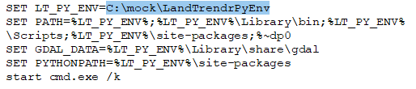

Reminder of the directory that we want the path to bolded:

C:\LandTrendrGEE

├───**LandTrendrPyEnv**

└───LT-ChangeDB

**Start_LandTrendrPyEnv.bat** after editing:

3) Save the file to it original location and name - overwrite the original.

Double click on the **Start_LandTrendrPyEnv.bat** file to start the  **LandTrendrPyEnv Prompt**. You should get a window like the one below showing the current working directory. We’ll interact with it by typing python followed by the path to a script we want to execute.

Here is what the **LandTrendrPyEnv Prompt** should look like once opened.

4) Type python into the **LandTrendrPyEnv Prompt** to see if it can find the **LandTrendrPyEnv** Python install. If it worked, you’ll get a python command line:

If something failed you’ll get a window that looks like this:

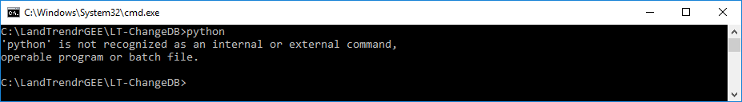

If it** **did fail check all your paths - relocate the **LandTrendrPyEnv*** *install older and make sure that it matches exactly what you set as the LT_PY_ENV variable when editing the **Start_LandTrendrPyEnv.bat **file.

# Dependency Check

## About

To ensure that **LandTrendrPyEnv** was installed correctly and contains the Python libraries required by **LT-ChangeDB** scripts, we can run a test to check.

## Check for required libraries

We check for libraries by running a script from the **LandTrendrPyEnv Prompt***. *We’ll run a script to test for dependencies. If the python command line is still open from the previous step (designated as: >>>), then type: exit() into the prompt and hit enter to close the python interpreter. Alternatively, close the **LandTrendrPyEnv Prompt** and open a new one by double-clicking the **Start_LandTrendrPyEnv.bat*** *file in the **LT-ChangeDB** folder.

The script to test dependencies is called **01_dependency_check.py**. It is found in the **LT-ChangeDB** program files folder. To run it type python  followed by a space in the command line of the **LandTrendrPyEnv Prompt** and then type 01 and hit the tab key to autocomplete the filename. If the file was not found by autocomplete, then drag the **01_dependency_check.py** file into the command line, which will append the file’s path to the current command. The command line should look similar to this now:

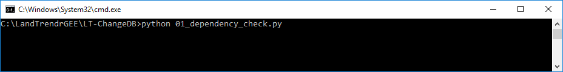

Example: python 01_dependency_check.py (if autocomplete worked)

...or

Example: python C:\LandTrendrGEE\LT-ChangeDB\01_dependency_check.py

Note that if your path has any spaces in it, the path in the command line should be enclosed by quotations, so that it is interpreted as a single string of text - this is only relevant if you manually type the script file name. Using either autocomplete or drag and drop will automatically add quotes if needed. See the following example where one of the folders is called "misc programs", in which case quotations are needed around the entire file path

Example: python "C:\misc programs\LT-ChangeDB\01_dependency_check.py"

Before you hit enter, make sure that the prompt is the active application, if you drag in a file to the prompt, generally Windows Explorer is the active application, so just click on the top bar of the **LandTrendrPyEnv Prompt**, then hit the enter key to start the program.

If everything is okay with dependencies you should get a message like this:

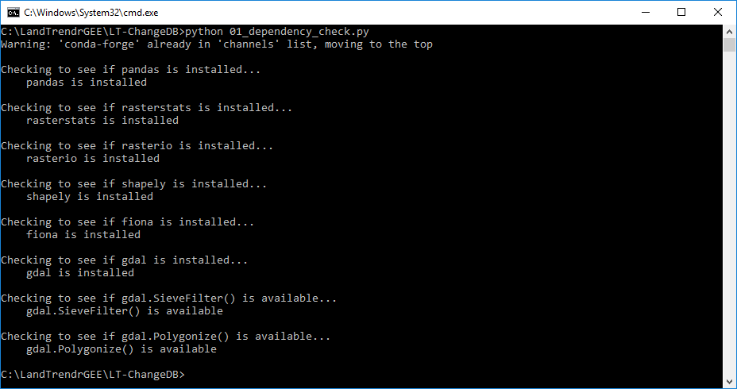

Where it says that each library checked **is** installed. If there were any missing libraries, the message would read **is not** installed. Since this **LandTrendrPyEnv** is pre-packaged, there should be no problems, but this is just a good test of the system.

If it fails on any library, contact Justin Braaten ([jstnbraaten@gmail.com](mailto:jstnbraaten@gmail.com)) to find out what to do.

# Project Setup

## About

For each discrete geographic region you want to assemble change data for, you need to create a new project directory. This project region folder will hold a series of subfolders that are created by a python script where all of the data from Earth Engine will go, as well as all the data generated from post-processing scripts. You can create this project folder anywhere on your system. For consistency in this guide, I’m going to put it inside the **LandTrendrGEE** folder that was described in the **[Directory Setu**p](#heading=h.7k7uc2kddhr9) section.

## Create Project Directory

1. Make a new folder on your system to hold **LT-ChangeDB** post-processing files. In this example, I make a parent **projects** folder in the **LandTrendrGEE** folder that will hold a series of separate regions. I manually create a new folder called **projects **and a subfolder for a project called **mora** (Mount Rainier). The following diagram shows my current directory structure - the bolded folders were just created.

<table>
  <tr>
    <td>C:\LandTrendrGEE
├───LandTrendrPyEnv
├───LT-ChangeDB
└───projects
    └───mora</td>
  </tr>
</table>

1. Create the project directory structure. Open **LandTrendrPyEnv Prompt** by double clicking on the **Start_LandTrendrPyEnv.bat** file in the **LT-ChangeDB*** *folder.

Type python in the prompt followed by a space and then type 02 and hit the tab key to autocomplete the filename. If the file was not found by autocomplete, then drag in the **02_project_setup.py*** *file from the **LT-ChangeDB*** *folder. The command should look like this:

Example of autocomplete:

<table>
  <tr>
    <td>C:\LandTrendrGEE\LT-ChangeDB>python 02_preoject_setup.py</td>
  </tr>
</table>

Example of script path drag and drop

<table>
  <tr>
    <td>C:\LandTrendrGEE\LT-ChangeDB>python C:\LandTrendrGEE\LT-ChangeDB\02_preoject_setup.py</td>
  </tr>
</table>

After hitting the enter key, a Windows Explorer popup will appear prompting you to "Select or create and select a project head folder" that will hold all the raster and vector data for a specific study area. The prompt should default to the top of all open applications windows. If it doesn’t, minimize other open windows until you see it.

1. Navigate to the project folder, select it and press the OK button.

The program will then generate a directory structure in the head project folder you selected that looks like this:

<table>
  <tr>
    <td>Project Head (mora)
├───raster
│   ├───landtrendr
│   │   ├───change
│   │   └───segmentation
│   └───prep
│       └───gee_chunks
├───scripts
├───timesync
│   ├───prep
│   ├───raster
│   └───vector
├───vector
└───video</td>
  </tr>
</table>

In the following steps these folders will be filled with files manually and automatically from Python scripts.  

# Vector Setup

## About

In this step you’ll run a script to standardize an existing vector file that defines the boundary of your study area. The script will automatically create a new ESRI Shapefile projected to EPSG:4326 (WGS84 Lat Long) and zips it up with all the .shp sidecar files (.dbf, .prj, .shx). This zipped shapefile will be uploaded to Google Earth Engine and define the region that LandTrendr is run on.

The vector file that you use can have a single feature (like a single park boundary) or multiple features (all park boundaries for a given network). In any case, each study region needs to be identifiable by a unique ID for a given attribute (we’ll refer to this as a key-value pair). In the vector file that I’m using for the demo, I have a single boundary for Mount Rainier. The **Key** attribute is "PARK_CODE" and the **Value** for the feature of interest is “MORA”  

Google Earth Engine will want a "key-value" pair to know what feature in the vector should be analyzed by LandTrendr. It is important that both the Key and the Value not have hyphens (-), underscores are fine. Hyphens are a reserved character for use in filename parsing in LT-ChangeDB scripts. The key and value of the feature in this project will appear in file names, so if there is a hyphen in either the Key or the Value, then the system will break. Before moving on make sure that you have an area of interest file that meets the requirements described here. Once you have a shapefile with a unique ID defined by a Key (attribute field name) and Value (attribute value for a given feature) then move to creating a version for use in Google Earth Engine.

## Create a Google Earth Engine AOI File

1. Move the area of interest (AOI) shapefile (described previously) and all of its associated files to the "**vector**" folder within your project head folder created in the previous [Project Setup](#heading=h.qtiyguaspsr0) section. 

<table>
  <tr>
    <td>Project Head (mora)
├───raster
│   ├───landtrendr
│   │   ├───change
│   │   └───segmentation
│   └───prep
│       └───gee_chunks
├───scripts
├───timesync
│   ├───prep
│   ├───raster
│   └───vector
├───vector
└───video</td>
  </tr>
</table>

1. Open **LandtrendrPyEnv prompt** and type python then leave a space and then drag in the file **03_vector_setup.py*** *or autocomplete on 03* *and hit enter to run the script

Example of autocomplete:

<table>
  <tr>
    <td>C:\LandTrendrGEE\LT-ChangeDB>python 03_vector_setup.py</td>
  </tr>
</table>

Example of script path drag and drop

<table>
  <tr>
    <td>C:\LandTrendrGEE\LT-ChangeDB>python C:\LandTrendrGEE\LT-ChangeDB\03_vector_setup.py</td>
  </tr>
</table>

A Windows Explorer prompt will appear requesting that you select the project head folder

Navigate to the head project directory, select it and hit the OK button

A second prompt will appear listing available *.shp files in the vector directory and requests that you select a *.shp file to prepare for GEE. Select the *.shp file that you want to represent the area of interest for this project.

The program will create a new shapefile that appends some information to the end of the original file name and then zips a copy for upload to Google Earth Engine. See the bolded files below. The zipped file (*.zip) will be uploaded to Google Earth Engine in a following step.

<table>
  <tr>
    <td>Project Head (mora)
├───raster
├───scripts
├───timesync
├───vector
│       mora_aoi.dbf
│       mora_aoi.prj
│       mora_aoi.shp
│       mora_aoi.shx
│       mora_aoi_ltgee.zip
│       mora_aoi_ltgee_epsg4326.dbf
│       mora_aoi_ltgee_epsg4326.prj
│       mora_aoi_ltgee_epsg4326.shp
│       mora_aoi_ltgee_epsg4326.shx
│
└───video</td>
  </tr>
</table>

# Google Earth Engine Setup

## Access

We’ll be using [Google Earth Engine](https://earthengine.google.com/) (GEE) to run LandTrendr ([LT-GEE](https://github.com/eMapR/LT-GEE)). GEE requires that a Google-associated email account be granted access. If you don’t have GEE access you can request it here: 

[https://signup.earthengine.google.com/#!/](https://signup.earthengine.google.com/#!/)

If you need to sign up, you’ll be asked what you intend to do with Earth Engine. I’ve not heard of anyone being denied access, but make your response compelling.

We’ll be using the GEE JavaScript API. Here is a link to the API User Guide for reference: [https://developers.google.com/earth-engine/](https://developers.google.com/earth-engine/)

The JavaScript GEE code editor (IDE) can be accessed here:

[https://code.earthengine.google.com/](https://code.earthengine.google.com/)

The first time you access the code editor, you will probably be prompted to setup a default user code repository. The eMapR lab default code repository, for instance, is *users/***_emaprlab_***/default*. The default code repository might be suggested from your email, however, you may need to, or optionally define it. If you are required or choose to define it, make it short and reasonably representative/descriptive of you as a user or organization - it likely has to be unique.

## Exploration

1. Get comfortable with the JavaScript GEE IDE, move panel sliders, click on tabs, expand script libraries and documentation. 

2. Within the **Script Manager **tab, expand the **Examples** repository and run through some of the example for Images, Image Collection, and Feature Collection.

3. When working on examples, zoom, pan, and click (view the Inspector tab), and watch for things printed to the console

## Add required repositories

We have a series of scripts and applications that you need to add to your GEE account. Visit these URL links to add required scripts to your GEE account:

The following link adds generic scripts and functions for using LandTrendr to your script library. It will show up under your **Reader **repository under the **Scripts** tab in the left panel of the GEE IDE

[https://code.earthengine.google.com/?accept_repo=users/emaprlab/public](https://code.earthengine.google.com/?accept_repo=users/emaprlab/public)

The following link adds scripts and applications specific to NPS annual change mapping to your GEE script library. It will show up under either your **Reader** repository under the **Scripts** tab in the left panel of the GEE IDE.

[https://code.earthengine.google.com/?accept_repo=users/emaprlab/NPS-LT-ChangeDB](https://code.earthengine.google.com/?accept_repo=users/emaprlab/NPS-LT-ChangeDB)

# Vector Upload to Google Earth Engine

In the previous [Vector Setup](#heading=h.7ncjbx4zupdj) step we generated a zipped directory of a shapefile that defines the region of this project. Now we’ll upload that file as an asset to your GEE account so it can be used to define the area that LandTrendr should be run on. 

GEE User Guide reference for importing vectors:

[https://developers.google.com/earth-engine/importing](https://developers.google.com/earth-engine/importing)

## Instructions

1. If not already open, open the GEE IDE: [https://code.earthengine.google.com/](https://code.earthengine.google.com/). If not already signed in, you’ll be prompted to log in to your GEE account. 

1. Once the IDE opens click on the **Assets** tab in the left panel to open the **Assets Manager**. If you’ve not uploaded assets previously, then you’ll be prompted to **Create Home Folder**

Click the button and you’ll be presented with a new window where you are to define the name of the home folder. I would provide the same name as your user name in the **Scripts** library. For instance the eMapR user name is "emaprlab" (from: *users/***_emaprlab_***/default)* so I entered “emaprlab” as my asset home folder. This is just for consistency - it doesn’t matter that much. Here is an example from Al Kirschbaum:* *

1. If you’ve just set up your GEE **Assets** folder, or it already exists, you should be able to Click the **New** button to release a drop down menu and then select **Table upload**

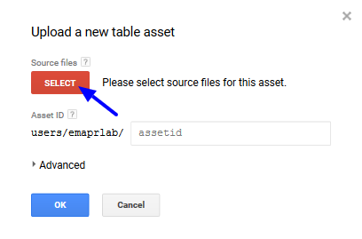

1. Select the .zip file from vector subfolder of the head project directory

Optionally rename the file and hit OK

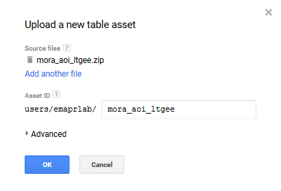

An **Asset Ingestion** job, which can be monitored in the **Task Manager** found under the **Tasks** tab in the right panel of the GEE IDE, will start. If you don’t see the job, you may have to refresh the browser. In a few minutes the process should complete and you will see your region in the **Asset Manager** panel - if you don’t see it after the job completes, then refresh the assets and/or the browser.

Job starts:

Asset upload and ingestion completes:

If you get an error, contact Justin Braaten at jstnbraaten@gmail.com

# Create an LT-ChangeDB script folder

In a following step you’ll be making a copy of a master script to generate segmentation data. You’ll need a place to put this script copy that is writable by you.

1. Within the GEE IDE under the **Scripts** tab click on the **NEW **button to release a dropdown menu - select the **Folder** option

1. A new window will appear asking you to define the repository and the new folder’s name. In this example, the repository is selected as the default and we’ve named the new folder **LT-ChangeDB**. Hit the **OK** button when you’re done.

You’ll now see the new folder in the repository that you selected. This folder is where you’ll copy and save your personal scripts to.

# LandTrendr Parameter Testing

GEE has made it possible to pretty quickly do visual assessments of the effect of various LandTrendr parameter settings. There are two interfaces for testing and exploring parameters. There is :

1. A time series profile application that shows the results of segmentation for a given pixel time series

2. A greatest disturbance mapping application that shows disturbances for a given set of parameters.

To access these applications make sure that you’ve added the [required repositories](#heading=h.ynfzhje5e82d). Open the GEE [IDE](https://code.earthengine.google.com/) and expand the **user/emaprlab/nps_annual_change** repository (possible that this name will change). Note that the repo might be under either **Reader or Writer.** 

## 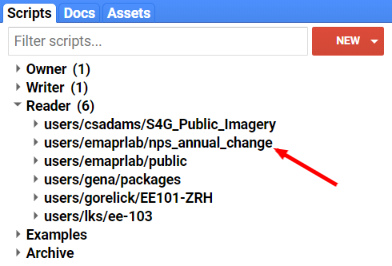

Expand the repo and you’ll find files: 

1. Get LandTrendr ChangeDB Segmentation Data

2. UI LandTrendr Disturbance Mapper TESTING

3. UI LandTrendr Pixel Time Series Plot TESTING

Clicking on a file will open it in the GEE IDE editor.

## Time Series Segmentation App

The *UI LandTrendr Pixel Time Series Plotter* will plot the Landsat surface reflectance source and LandTrendr-fitted index for a selected pixel.  The script is useful for simply exploring and visualizing the spectral-temporal space of a location, for comparing the effectiveness of a series of indices for identifying landscape change, and for parameterizing LandTrendr to work best for your study region.

Click on the **UI LandTrendr Pixel Time Series Plot TESTING** file. It will open in the GEE IDE editor, click the **Run** button

A GUI will populate the Map window of the GEE IDE, drag the top of the Map panel to the top of the IDE so that it is as large as possible. It should now look like this:

Here are some instructions for running the application:

1. Click on the script to load it and then click the Run button to initialize the application.

2. Drag the map panel to the top of the page for better viewing.

3. Define a year range over which to generate annual surface reflectance composites.

4. Define the date range over which to generate annual composites. The format is (month-day) with two digits for both month and day. Note that if your study area is in the southern hemisphere and you want to include dates that cross the year boundary to capture the summer season, this is not possible yet - it is on our list!

5. Select [spectral indices and bands](#heading=h.x5i65rpzi1jj) to view. You can select one or many.

6. Optionally define a pixel coordinate set to view the time series of, alternatively you’ll simply click on the map. Note that the coordinates are in units of latitude and longitude formatted as decimal degrees (WGS 84 EPSG:4326). Also note that when you click a point on the map, the coordinates of the point will populate these entry boxes.

7. Define the LandTrendr segmentation parameters. See the [LT Parameters](https://docs.google.com/document/d/1MuYjttWOZvqWPAz2BQvr6IPE7N4r9dxW2PuKJoSpxe4/edit#heading=h.w7mtxeya9mfh) section for definitions.

8. Either click a location on the map or hit the Submit button. If you want to change anything about the run, but keep the coordinate that you clicked on, just make the changes and then hit the Submit button - the coordinates for the clicked location are saved to the pixel coordinates input boxes.

Wait a minute or two and plots of source and LandTrendr-fitted time series data will appear for all the indices you selected. The next time you click a point or submit the inputs, any current plots will be cleared and the new set will be displayed.

Here we see forest decline near on Hurricane Ridge in Olympic National Park from three different indices

## 

Try different combinations of parameters on points of interest, save screenshots showing parameters and LT fits and compare them to find the best parameters and index for your project.

## Greatest Disturbance Mapping App

The *UI LandTrendr Disturbance Mapper* will display map layers of disturbance attributes including: year of disturbance detection, magnitude of disturbance, duration of disturbance, and pre-disturbance spectral value.

Click on the **UI LandTrendr Disturbance Mapper TESTING** file. It will open in the GEE IDE editor, click the **Run** button

A GUI will populate the Map window of the GEE IDE, drag the top of the Map panel to the top of the IDE so that it is as large as possible. It should now look like this:

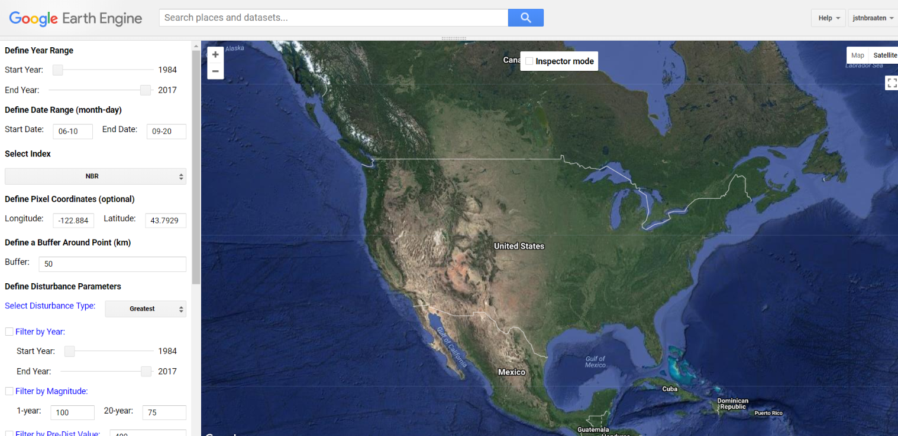

Here are some instructions for running the application:

1. Click on the script to load it and then click the Run button to initialize the application.

2. Drag the map panel to the top of the page for better viewing.

3. Define a year range over which to identify disturbances - best to set this close to the maximum range, you can filter disturbances by year in a different setting below.

4. Define the date range over which to generate annual composites. The format is (month-day) with two digits for both month and day Note that if your study area is in the southern hemisphere and you want to include dates that cross the year boundary to capture the summer season, this is not possible yet - it is on our list!

5. Select [spectral index or band](#heading=h.x5i65rpzi1jj) to use for disturbance detection.

6. Optionally define a pixel coordinate set to define the center of the disturbance map, alternatively you’ll simply click on the map. Note that the coordinates are in units of latitude and longitude formatted as decimal degrees (WGS 84 EPSG:4326). Also note that when you click a point on the map, the coordinates of the point will populate these entry boxes.

7. Define a buffer around the center point defined by a map click or provided in the latitude and longitude coordinate boxes from step 6. The units are in kilometers. It will draw and clip the map to the bounds of the square region created by the buffer around the point of interest.

8. Define the disturbance type you are interested in - this applies only if there are multiple disturbances in a pixel time series. It is a relative qualifier among a series of disturbances for a pixel time series.

9. Optionally filter disturbances by the year of detection. Adjust the sliders to constrain the results to a given range of years. The filter is only applied if the Filter by Year box is checked.

10. Optionally filter disturbances by magnitude. Magnitude filtering is achieved by interpolation of a magnitude threshold from 1 year to 20 years. Define the magnitude threshold considered a disturbance for disturbances that are one year in duration and also 20 years in duration. If you want to apply the same threshold value across all durations, enter the same value in each box. The values should be the minimum spectral delta value that is considered a disturbance. They should be the absolute value and multiplied by 1000 for decimal-based surface reflectance bands and spectral indices (we multiply all the decimal-based data by 1000 so that we can convert the data type to signed 16-bit and retain some precision). The filter is only applied if the Filter by Magnitude box is checked.

11. Optionally filter by pre-disturbance spectral value. This filter will limit the resulting disturbances by those that have a spectral value prior to the disturbance either greater/less than (depending on index) or equal to the defined value. The units are a of the spectral index selected for segmentation and should be scaled by 1000 (if you are you only want disturbances that had an NBR value of 0.4 prior to disturbance, you would set this parameter to 400). The filter is only applied if the Filter by Pre-Dist Value box is checked.

12. Optionally filter by a minimum disturbance patch size, as defined by 8-neighbor connectivity of pixels having the same disturbance year of detection. The value is the minimum number of pixel in a patch. The filter is only applied if the Filter by MMU box is checked.

13. Define the LandTrendr segmentation parameters. See the [LT Parameters](https://docs.google.com/document/d/1MuYjttWOZvqWPAz2BQvr6IPE7N4r9dxW2PuKJoSpxe4/edit#heading=h.w7mtxeya9mfh) section for definitions.

Inspector mode selector. In the center top of the map there is a check box for whether to interact with the map in Inspector mode or not. When inspector mode is activated, map clicks engage the GEE Inspector functionality so that you can explore map layer values for a point (see the Inspector tab). When deactivated, a map click will start mapping disturbances for the region surrounding the clicked point.

# Generate LandTrendr Data

We’ll run LT-GEE (LandTrendr on Google Earth Engine) to segment a selected Landsat spectral time series band or index and then fit to the vertices that are identified, tasseled cap brightness, greenness, and wetness (Crist, 1985). All of the data necessary for populating an annual change database will be assembled in a single image with >100 bands that will be exported to the Google Drive account associated with your EE account and then downloaded locally.

1. Open the GEE [IDE](https://code.earthengine.google.com/) and expand the **user/emaprlab/NPS-LT-ChangeDB** repository in the **Scripts** tab found on the left panel. Note that the repository will be under your **Reader **directory.

2. Copy the master **Get LT-ChangeDB Segmentation Data** script file found in the **Scripts** subfolder to the **LT-ChangeDB** folder you created in a previous step, so you can edit and save it (the master copy is read only and used as a template by everyone using this system). To copy the file: click, hold, and drag the file from **user/emaprlab/NPS-LT-ChangeDB:Scripts/** repository to your **LT-ChangeDB **folder.

3. Click on the **Get LT-ChangeDB Segmentation Data** script file you just copied to your **LT-ChangeDB **folder. When it loads in the editor it will look like this:

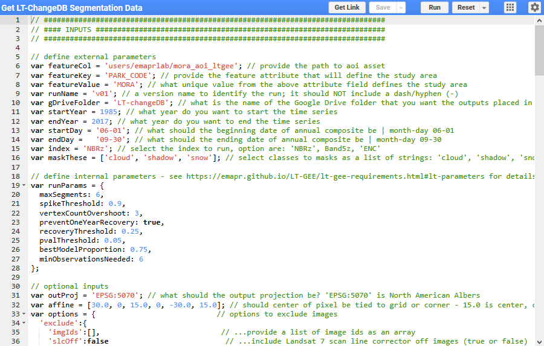

1. There are two sections to this script file: an **inputs** section and a **processing **section. You’ll edit the parameters in the **inputs **section to define the area to run LandTrendr on, over what period of years, over what season, what to mask, how to perform segmentation, and optionally set output coordinate reference information, as well as excluding images.

2. Edit the inputs as desired. Use the following tables of definitions to help you set the parameters.

## Collection building parameters

The following parameters control the building of annual image collections that are composited and provided as input to LandTrendr for spectral-temporal segmentation.

<table>
  <tr>
    <td>Parameter</td>
    <td>Type</td>
    <td>Definition</td>
  </tr>
  <tr>
    <td>featureCol*</td>
    <td>String</td>
    <td>The path to the area of interest file that was uploaded in a previous step. See the instructions* below for identifying the path. </td>
  </tr>
  <tr>
    <td>featureKey</td>
    <td>String</td>
    <td>The feature attribute that will define the study area over which to run LandTrendr. A field name from the attribute table of the uploaded shapefile. See Vector Setup section.</td>
  </tr>
  <tr>
    <td>featureValue</td>
    <td>String</td>
    <td>The value from the attribute field set as featureKey that defines  the study area over which to run LandTrendr. See Vector Setup section. </td>
  </tr>
  <tr>
    <td>runName</td>
    <td>String</td>
    <td>A unique name for this LandTrendr/project run. Example 'v1' (you might want to try different parameters sets, in which case you might have several versions: v1, v2, v3, etc). It should not contain any hyphens (-) or special characters besides underscore (_).</td>
  </tr>
  <tr>
    <td>gDriveFolder</td>
    <td>gDriveFolder</td>
    <td>The name of the Google Drive folder that the resulting data will be sent to. If the folder does not exist, it will be created on-the-fly. It will not write to subfolder of your Google Drive. The folder with either be created at the first level or must exist at the first level.</td>
  </tr>
  <tr>
    <td>startYear </td>
    <td>Integer</td>
    <td>The start year of the annual time series over which LandTrendr will operate.</td>
  </tr>
  <tr>
    <td>endYear </td>
    <td>Integer</td>
    <td>The end year of the annual time series over which LandTrendr will operate.</td>
  </tr>
  <tr>
    <td>startDay </td>
    <td>String</td>
    <td>The minimum date in the desired seasonal range over which to generate annual composite. Formatted as 'mm-dd'.</td>
  </tr>
  <tr>
    <td>endDay </td>
    <td>String</td>
    <td>The maximum date in the desired seasonal range over which to generate annual composite. Formatted as 'mm-dd'.</td>
  </tr>
  <tr>
    <td>index </td>
    <td>String</td>
    <td>The spectral index or band from the list of index codes to be segmented by LandTrendr.</td>
  </tr>
  <tr>
    <td>maskThese</td>
    <td>List</td>
    <td>A list of strings that represent names of images features to mask. Features can include 'cloud', 'shadow', 'snow', 'water'.</td>
  </tr>
</table>

**FeatureCol* parameter: this is defined as the path to the shapefile asset you uploaded to GEE in a [previous step](#heading=h.qv236ea764hk). To get the path, open the **Assets **tab found in the left panel of the GEE IDE, click on the AOI file name you’d like to use, which will open up a metadata window, copy the **Table ID** and paste it as the **FeatureCol** parameter argument

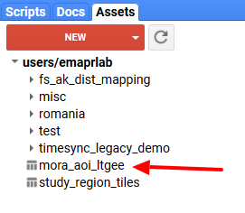

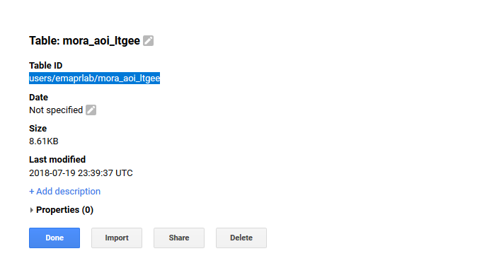

### LandTrendr spectral indices

The following table lists the Landsat-based spectral indices and transformations that are available to run LandTrendr on.

<table>
  <tr>
    <td>Code</td>
    <td>Name</td>
    <td>Disturbance delta </td>
  </tr>
  <tr>
    <td>NBR</td>
    <td>Normalized Burn Ratio</td>
    <td>-1</td>
  </tr>
  <tr>
    <td>NDVI</td>
    <td>Normalized Difference Vegetation Index</td>
    <td>-1</td>
  </tr>
  <tr>
    <td>NDSI</td>
    <td>Normalized Difference Snow Index</td>
    <td>-1</td>
  </tr>
  <tr>
    <td>NDMI</td>
    <td>Normalized Difference Moisture Index</td>
    <td>???</td>
  </tr>
  <tr>
    <td>TCB</td>
    <td>Tasseled-Cap Brightness</td>
    <td>1</td>
  </tr>
  <tr>
    <td>TCG</td>
    <td>Tasseled-Cap Greenness</td>
    <td>-1</td>
  </tr>
  <tr>
    <td>TCW</td>
    <td>Tasseled-Cap Wetness</td>
    <td>-1</td>
  </tr>
  <tr>
    <td>TCA</td>
    <td>Tasseled-Cap Angle</td>
    <td>-1</td>
  </tr>
  <tr>
    <td>B1</td>
    <td>Thematic Mapper-equivalent Band 1</td>
    <td>1</td>
  </tr>
  <tr>
    <td>B2</td>
    <td>Thematic Mapper-equivalent Band 2</td>
    <td>1</td>
  </tr>
  <tr>
    <td>B3</td>
    <td>Thematic Mapper-equivalent Band 3</td>
    <td>1</td>
  </tr>
  <tr>
    <td>B4</td>
    <td>Thematic Mapper-equivalent Band 4</td>
    <td>-1</td>
  </tr>
  <tr>
    <td>B5</td>
    <td>Thematic Mapper-equivalent Band 5</td>
    <td>1</td>
  </tr>
  <tr>
    <td>B7</td>
    <td>Thematic Mapper-equivalent Band 7</td>
    <td>1</td>
  </tr>
  <tr>
    <td>B5z</td>
    <td>Thematic Mapper-equivalent Band 5 standardized to mean 0 and stdev 1</td>
    <td>1</td>
  </tr>
  <tr>
    <td>NBRz</td>
    <td>Normalized Burn Ratio standardized to mean 0 and stdev 1</td>
    <td>1</td>
  </tr>
  <tr>
    <td>ENC</td>
    <td>6 band composite - mean of z-score: [B5, B7, TCW, TCA, NDMI, NBR]</td>
    <td>1</td>
  </tr>
</table>

## LandTrendr segmentation parameters

The following parameters control how LandTrendr performs spectral-temporal segmentation. Besides the following parameter definitions, more information and context can be found in the original paper describing LandTrendr ([Kennedy et al, 2010](http://geotrendr.ceoas.oregonstate.edu/files/2015/05/Kennedy_etal2010.pdf))

<table>
  <tr>
    <td>Parameter</td>
    <td>Type</td>
    <td>Default</td>
    <td>Definition</td>
  </tr>
  <tr>
    <td>maxSegments</td>
    <td>Integer</td>
    <td> </td>
    <td>Maximum number of segments to be fitted on the time series</td>
  </tr>
  <tr>
    <td>spikeThreshold</td>
    <td>Float</td>
    <td>0.9</td>
    <td>Threshold for dampening the spikes (1.0 means no dampening)</td>
  </tr>
  <tr>
    <td>vertexCountOvershoot</td>
    <td>Integer</td>
    <td>3</td>
    <td>The initial model can overshoot the maxSegments + 1 vertices by this amount. Later, it will be pruned down to maxSegments + 1</td>
  </tr>
  <tr>
    <td>preventOneYearRecovery</td>
    <td>Boolean</td>
    <td>FALSE</td>
    <td>Prevent segments that represent one year recoveries</td>
  </tr>
  <tr>
    <td>recoveryThreshold</td>
    <td>Float</td>
    <td>0.25</td>
    <td>If a segment has a recovery rate faster than 1/recoveryThreshold (in years), then the segment is disallowed</td>
  </tr>
  <tr>
    <td>pvalThreshold</td>
    <td>Float</td>
    <td>0.1</td>
    <td>If the p-value of the fitted model exceeds this threshold, then the current model is discarded and another one is fitted using the Levenberg-Marquardt optimizer</td>
  </tr>
  <tr>
    <td>bestModelProportion</td>
    <td>Float</td>
    <td>1.25</td>
    <td>Takes the model with most vertices that has a p-value that is at most this proportion away from the model with lowest p-value</td>
  </tr>
  <tr>
    <td>minObservationsNeeded</td>
    <td>Integer</td>
    <td>6</td>
    <td>Min observations needed to perform output fitting</td>
  </tr>
</table>

## Optional Parameters

<table>
  <tr>
    <td>Parameter</td>
    <td>Type</td>
    <td>Definition</td>
  </tr>
  <tr>
    <td>outProj</td>
    <td>String</td>
    <td>The desired projection of the output GeoTIFFs defined as an EPSG code with the format ‘EPSG:####’. Master script defaults to Albers Equal Area Conic for North America </td>
  </tr>
  <tr>
    <td>affine</td>
    <td>List of floating point values</td>
    <td>Option to define whether the pixel grid is tied to the center or corners of pixels. The third and sixth values determine the position. Use 15.0 to align center of pixels to the grid or 0.0 for pixel corners to be tied to the grid. The master script defaults to 15.0 (pixel center snaps to grid, which is what USGS NLCD products use).  </td>
  </tr>
  <tr>
    <td>options</td>
    <td>Dictionary of options </td>
    <td>An option to exclude images either by defining a list of image IDs and or excluding Landsat ETM+ scan line corrector off images(images with gaps in data). See the master script for an example of parameter structure. options.exclude.imgIds requires a list of image id strings (defaults to no image exclusion). options.exclude.slcOff requires a Boolean of either false or true for whether to exclude Landsat ETM+ SLC-off images (defualts to false). Image IDs can be obtained from the UI Image Screener app  </td>
  </tr>
</table>

3. After all the parameters are set, hit the **Run** button at the top of the script panel of the GEE IDE. In a moment the **Tasks** tab in the right panel of the IDE will turn orange alerting you to jobs that need to be started (if it doesn’t appear to be working, be patience a couple minutes). Activate the **Tasks** tab and you should see six jobs that need to be started. The job names provide information about the LandTrendr run. The last file parts distinguish the type of data that will be generated from the GEE script and output to Google Drive.

The following sections describes what each job/file is.

## Output Description

### File name description key

Each file contains information about the LandTrendr run, both for your information and for the coming Python scripts to decide how to handle the various files. Therefore, you should not change files names. The files contain 8 pieces of information, each separated by a hyphen. The key below describes what each pieces represents.

File string part key: AA-BB-CC-DD-EE-FF-GG-HH

<table>
  <tr>
    <td>File name part</td>
    <td>Description</td>
  </tr>
  <tr>
    <td>AA</td>
    <td>featureKey (from the collection building parameters)</td>
  </tr>
  <tr>
    <td>BB</td>
    <td>featureValue (from the collection building parameters)</td>
  </tr>
  <tr>
    <td>CC</td>
    <td>index (from the collection building parameters)</td>
  </tr>
  <tr>
    <td>DD</td>
    <td>concatenation(startYear, endYear) format: yyyy|yyyy (from the collection building parameters)</td>
  </tr>
  <tr>
    <td>EE</td>
    <td>concatenation(startDay, endDay) format: mmdd|mmdd (from the collection building parameters)</td>
  </tr>
  <tr>
    <td>FF</td>
    <td>runName (from the collection building parameters)</td>
  </tr>
  <tr>
    <td>GG</td>
    <td>outProj (from the collection building parameters)</td>
  </tr>
  <tr>
    <td>HH*</td>
    <td>Data type, see next table (autogenerated)</td>
  </tr>
</table>

*The following table describes the six different data files that are generated 

<table>
  <tr>
    <td>Data type</td>
    <td>Description</td>
  </tr>
  <tr>
    <td>ClearPixelCount</td>
    <td>A multi-band GeoTIFF file that provides a count of the number of pixels that went into generating each annual composite.</td>
  </tr>
  <tr>
    <td>TSdata</td>
    <td>A multi-band GeoTIFF TimeSync-Legacy data stack.</td>
  </tr>
  <tr>
    <td>LTdata</td>
    <td>A multi-band GeoTIFF LandTrendr segmentation data stack.</td>
  </tr>
  <tr>
    <td>TSaoi</td>
    <td>A shapefile that defined the area run for TimeSync-Legacy data generation. It is buffed out a little from the original file and will be in the projection defined by the outProj parameter.</td>
  </tr>
  <tr>
    <td>LTaoi</td>
    <td>A shapefile that defined the area run for LandTrendr segmentation data generation. It is buffed out 300m (10 pixels) from the original file and will be in the projection defined by the outProj parameter.</td>
  </tr>
  <tr>
    <td>runInfo</td>
    <td>CSV file containing metadata about the LandTrendr run.</td>
  </tr>
</table>

1. Click the **Run **button following each job. After clicking **Run** on a job you’ll be prompted by a window asking you to confirm aspects of the job - click **Run**. Little gears will start to turn next to the jobs, indicating that the job is being processed. You can start all the jobs concurrently - no need to wait for one to finish before starting the next. 

When the jobs finish, the job title box will turn blue and a check mark and time to completion will appear following. Wait until all jobs complete and then proceed to the next step of downloading the data. Each file type will be exported as either GeoTIFF, shapefile, or csv to the Google Drive folder you specified in the collection building parameters.

# Download LandTrendr Data from Google Drive

Go to the Google Drive account associated with your Earth Engine account and find the folder that you specified for the* gDriveFolder *parameter when running LT-GEE. If the folder did not exist prior to running the script, the folder will be at the first level of the Google Drive directory. Open the folder and you should find .tif files, files associated with ESRI Shapefiles, and a .csv file. If your area of interest was large, there might be several .tif files for both *TSdata and *LTdata. If output files are large, GEE will divide them into a series of image chunks.

Download each file. Right click and select download. It’s recommended to highlight all the files that are not .tif and right click and select download, which will zip all the selected files and prompt a download. The .tif files should be downloaded individually, as it takes an incredibly long time to zip them all and download and usually it ends up missing some files. Once each file has finished downloading, find them on your computer and move them to the *\raster\prep\gee_chunks folder of your project directory. The files and folder structure should look like this:

<table>
  <tr>
    <td>Project Head (mora)
├───raster
│   ├───landtrendr
│   │   ├───change
│   │   └───segmentation
│   └───prep
│       └───gee_chunks
├───scripts
├───timesync
│   ├───prep
│   ├───raster
│   └───vector
├───vector
└───video</td>
  </tr>
</table>

Note that you might have to allow popups in your browser to allow files to download. Go to browser settings and search for popup settings.

If any of the files from the Google Drive download were zipped for downloading make sure they are unzipped directly into the *\raster\prep\gee_chunks folder and the original .zip file deleted. The files in the *\raster\prep\gee_chunks folder should look like the following directory tree. If you have a large study area, then *LTdata* might have a series of files with number appended signifying various spatial subsets (chunks) of the raster. 

<table>
  <tr>
    <td>Project Head (mora)
└───raster
    ├───landtrendr
    └───prep
        └───gee_chunks
                PARK_CODE-MORA-NBRz-7-19852017-06010930-v01-EPSG5070-ClearPixelCount.tif
                PARK_CODE-MORA-NBRz-7-19852017-06010930-v01-EPSG5070-LTaoi.cpg
                PARK_CODE-MORA-NBRz-7-19852017-06010930-v01-EPSG5070-LTaoi.dbf
                PARK_CODE-MORA-NBRz-7-19852017-06010930-v01-EPSG5070-LTaoi.fix
                PARK_CODE-MORA-NBRz-7-19852017-06010930-v01-EPSG5070-LTaoi.prj
                PARK_CODE-MORA-NBRz-7-19852017-06010930-v01-EPSG5070-LTaoi.shp
                PARK_CODE-MORA-NBRz-7-19852017-06010930-v01-EPSG5070-LTaoi.shx
                PARK_CODE-MORA-NBRz-7-19852017-06010930-v01-EPSG5070-LTdata.tif
                PARK_CODE-MORA-NBRz-7-19852017-06010930-v01-EPSG5070-runInfo.csv
                PARK_CODE-MORA-NBRz-7-19852017-06010930-v01-EPSG5070-TSaoi.cpg
                PARK_CODE-MORA-NBRz-7-19852017-06010930-v01-EPSG5070-TSaoi.dbf
                PARK_CODE-MORA-NBRz-7-19852017-06010930-v01-EPSG5070-TSaoi.fix
                PARK_CODE-MORA-NBRz-7-19852017-06010930-v01-EPSG5070-TSaoi.prj
                PARK_CODE-MORA-NBRz-7-19852017-06010930-v01-EPSG5070-TSaoi.shp
                PARK_CODE-MORA-NBRz-7-19852017-06010930-v01-EPSG5070-TSaoi.shx</td>
  </tr>
</table>

# Generate Annual Change Polygons

## Unpack Data from GEE

Open **LandTrendrPyEnv Prompt** by double clicking on the **Start_LandTrendrPyEnv.bat file** in the **LT-ChangeDB****_ _****folder**.

<table>
  <tr>
    <td>C:\LandTrendrGEE\LT-ChangeDB
    01_dependency_check.py
    02_project_setup.py
    03_vector_setup.py
    04_unpack_lt_ee_data.py
    05_extract_annual_change.py
    06_make_polygons.py
    07_append_zonal_stats.py
    08_make_tc_video.py
    ltcdb.py
    ltcdb.pyc
    README.md
    Start_LandTrendrPyEnv.bat
    tc_time_series.html</td>
  </tr>
</table>

Type python in the prompt followed by a space and then drag in the **04_unpack_lt_ee_data.py ** file* *from the **LT-ChangeDB folder** or type: 04 followed by the tab key to autocomplete find the file. The command should look like this:

Example of autocomplete:

<table>
  <tr>
    <td>C:\LandTrendrGEE\LT-ChangeDB>python 04_unpack_lt_ee_data.py
</td>
  </tr>
</table>

Example of script path drag and drop

<table>
  <tr>
    <td>C:\LandTrendrGEE\LT-ChangeDB>python C:\LandTrendrGEE\LT-ChangeDB\04_unpack_lt_ee_data.py
</td>
  </tr>
</table>

Hit enter and you’ll be asked to navigate to the project head folder select the folder **bolded**:

<table>
  <tr>
    <td>C:\LandTrendrGEE\LT-ChangeDB\projects\mora</td>
  </tr>
</table>

<table>
  <tr>
    <td>Project Head (mora)
├───raster
│   ├───landtrendr
│   │   ├───change
│   │   └───segmentation
│   └───prep
│       └───gee_chunks
├───scripts
├───timesync
│   ├───prep
│   ├───raster
│   └───vector
├───vector
└───video</td>
  </tr>
</table>

After selecting a folder, the program will work to unpack all data downloaded from Google Drive. The command prompt will look like this:

<table>
  <tr>
    <td>C:\LandTrendrGEE\LT-ChangeDB>python 04_unpack_lt_ee_data.py

Working on LT run: PARK_CODE-MORA-NBRz-7-19852017-06010930-v01
   Unpacking file:
      PARK_CODE-MORA-NBRz-7-19852017-06010930-v01-vert_yrs.tif
      PARK_CODE-MORA-NBRz-7-19852017-06010930-v01-vert_fit_idx.tif
      PARK_CODE-MORA-NBRz-7-19852017-06010930-v01-seg_rmse.tif
      PARK_CODE-MORA-NBRz-7-19852017-06010930-v01-ftv_tcb.tif
      PARK_CODE-MORA-NBRz-7-19852017-06010930-v01-ftv_tcg.tif
      PARK_CODE-MORA-NBRz-7-19852017-06010930-v01-ftv_tcw.tif
   Unpacking file:
      PARK_CODE-MORA-NBRz-7-19852017-06010930-v01-clear_pixel_count.tif
   Creating TC ftv delta data
      PARK_CODE-MORA-NBRz-7-19852017-06010930-v01-ftv_tcb_delta.tif
      PARK_CODE-MORA-NBRz-7-19852017-06010930-v01-ftv_tcg_delta.tif
      PARK_CODE-MORA-NBRz-7-19852017-06010930-v01-ftv_tcw_delta.tif
   Creating TC vert_fit data
      100% done
Done!
LT-GEE data unpacking took 4.8 minutes

C:\LandTrendrGEE\LT-ChangeDB>
</td>
  </tr>
</table>

The unpacked files will be placed in several subfolders of the project head folder. Files and some subfolders are named according to the file name given to the GEE output files ([File name description key](#heading=h.cikfk8fyn4aq)), excluding the projection. The major file types unpacked in the is step include: 

* **Run info file**: this is a .txt file that is placed directly inside the project head folder. It describes the LandTrendr run and includes all of the parameters used, as well as a list of all the images used to build the annual surface reflectance composites.

* **Segmentation files**: this set of files is unpacked into a subfolder of the *<project head>\raster\landtrendr\segmentation folder. They are output files from LandTrendr. Please see the [Segmentation Raster File Names and Definitions](#heading=h.no6fp058un2h) section for detail about the files. 

* **Vector file**: A shapefile that defines the boundary of the area run by LandTrendr is placed inside of the *<project head>\vector folder. If the shapefile you uploaded to GEE contained more than one feature, this shapefile will only include the feature defined by the key-value pair given in the LandTrendr parameters and will be buffered by 300m to account for changes that occur at the boundary. 

* **TimeSync files**: If you chose to export TimeSync files from GEE, then the unpacking script will move the TimeSync image files to the *<project head>\timesync\prep folder. It does not process them in this step, it simply moves them. It also places a shapefile in the *<project head>\timesync\vector folder. If the shapefile you uploaded to GEE contained more than one feature, this shapefile will only include the feature defined by the key-value pair given in the LandTrendr parameters. It represents the extent of the feature with a buffer 6300m to account the size of TimeSync image chip.

What to do with the packaged LT-GEE files in the prep folder - the plan was to delete them after unpacking - do park folks want to archive them to an "~ltgeearchive" folder? 

## Extract Annual Change as Rasters

Type python in the prompt followed by a space and then drag in the **05_extract_annual_change.py file*** *from the **LT-ChangeDB folder** or type: 05 followed by the tab key to autocomplete find the file. The command should look like this:

Example of autocomplete:

<table>
  <tr>
    <td>C:\LandTrendrGEE\LT-ChangeDB>python 05_extract_annual_change.py
</td>
  </tr>
</table>

Example of script path drag and drop

<table>
  <tr>
    <td>C:\LandTrendrGEE\LT-ChangeDB>python C:\LandTrendrGEE\LT-ChangeDB\05_extract_annual_change.py
</td>
  </tr>
</table>

After hitting the enter key, a Windows Explorer popup will appear prompting you to "Select the project head folder". The prompt should default to the top of all open application windows. If it doesn’t, minimize other open windows until you see it.

Generic example directory path to "project head folder"

<table>
  <tr>
    <td>C:\LandTrendrGEE
├───LandTrendrPyEnv
├───LT-ChangeDB
└───projects
    └───<project head folder></td>
  </tr>
</table>

Example path following the "mora" demo

<table>
  <tr>
    <td>C:\LandTrendrGEE\LT-ChangeDB\projects\mora</td>
  </tr>
</table>

After Selecting the project head folder the program will identify the LandTrendr run associated with the project, display its name and ask whether you would like to vegetation disturbance or growth. Type either **disturbance** or **growth** and hit enter.

Here is what is shown in the command prompt

<table>
  <tr>
    <td>Regarding LT run: PARK_CODE-MORA-NBRz-7-19852017-06010930-v01
What change do you want to map (disturbance or growth)?:
</td>
  </tr>
</table>

Next you’ll be asked to provide a minimum disturbance threshold. The value will be standard deviation times 1000. I’ve found that with the z-score indices (NBRz, Band5z, ENC) that 1.25 standard deviations seems like a pretty good threshold for minimum disturbance to consider. *Band5z* could maybe be a little greater like: 1.35-1.45. So go with a value of 1250 and see what happens.

<table>
  <tr>
    <td>Regarding LT run: PARK_CODE-MORA-NBRz-7-19852017-06010930-v01
What is the desired minimum change magnitude:
</td>
  </tr>
</table>

The progress will print to the console

<table>
  <tr>
    <td>Working on LT run: PARK_CODE-MORA-NBRz-7-19852017-06010930-v01
   38% done
</td>
  </tr>
</table>

The annual change rasters will be placed within a subfolder of the *<project_head>\raster\landtrendr\segmentation folder with the name equal to the LT-GEE job name plus the change type and the minimum magnitude threshold value, for example: PARK_CODE-MORA-NBRz-7-19842017-06010930-v01-disturbance_1250 

These files are all related to the LandTrendr segmentation and fitting to vertex processes.

Project Head

├───raster

    ├───landtrendr

        ├───change\<job>\

PARK_CODE-MORA-NBRz-7-19842017-06010930-change_attributes.csv

PARK_CODE-MORA-NBRz-7-19842017-06010930-change_dur.tif

PARK_CODE-MORA-NBRz-7-19842017-06010930-change_idx_mag.tif

PARK_CODE-MORA-NBRz-7-19842017-06010930-change_tcb_mag.tif

PARK_CODE-MORA-NBRz-7-19842017-06010930-change_tcb_post.tif

PARK_CODE-MORA-NBRz-7-19842017-06010930-change_tcb_pre.tif

PARK_CODE-MORA-NBRz-7-19842017-06010930-change_tcg_mag.tif

PARK_CODE-MORA-NBRz-7-19842017-06010930-change_tcg_post.tif

PARK_CODE-MORA-NBRz-7-19842017-06010930-change_tcg_pre.tif

PARK_CODE-MORA-NBRz-7-19842017-06010930-change_tcw_mag.tif

PARK_CODE-MORA-NBRz-7-19842017-06010930-change_tcw_post.tif

PARK_CODE-MORA-NBRz-7-19842017-06010930-change_tcw_pre.tif

PARK_CODE-MORA-NBRz-7-19842017-06010930-change_yrs.tif

See the [Appendix](#heading=h.1vdzlzn7ka5p) for definitions of the files

## Make Polygons from Annual Rasters

Type python in the prompt followed by a space and then drag in the **06_make_polygons.py file*** *from the **LT-ChangeDB folder** or type: 06 followed by the tab key to autocomplete find the file. The command should look like this:

Example of autocomplete:

<table>
  <tr>
    <td>C:\LandTrendrGEE\LT-ChangeDB>python 06_make_polygons.py
</td>
  </tr>
</table>

Example of script path drag and drop

<table>
  <tr>
    <td>C:\LandTrendrGEE\LT-ChangeDB>python C:\LandTrendrGEE\LT-ChangeDB\python 06_make_polygons.py
</td>
  </tr>
</table>

After hitting the enter key, a Windows Explorer popup will appear prompting you to "Select the project head folder". The prompt should default to the top of all open application windows. If it doesn’t, minimize other open windows until you see it.

Generic example directory path to "project head folder"

<table>
  <tr>
    <td>C:\LandTrendrGEE
├───LandTrendrPyEnv
├───LT-ChangeDB
└───projects
    └───<project head folder></td>
  </tr>
</table>

Example path following the "mora" demo

<table>
  <tr>
    <td>C:\LandTrendrGEE\LT-ChangeDB\projects\mora</td>
  </tr>
</table>

After you select the project head folder you’ll be presented with a list of raster change definitions that were generated in the previous step. You be asked to select which one to convert to polygons. Enter the number to the left of the change definition you want to convert.

<table>
  <tr>
    <td>Here is the list of raster change definitions:
1: PARK_CODE-MORA-NBRz-7-19852017-06010930-v01-disturbance_1250
2: PARK_CODE-MORA-NBRz-7-19852017-06010930-v01-growth_1250

Which one would you like to convert to polygons (enter the number):
</td>
  </tr>
</table>

Next you’ll be asked to provide a minimum mapping unit. The value is the minimum number of connected pixels that define a patch (neighbor rule defined in next step). If you select 10, then patches with < 10 pixels will be ignored in conversion from raster to vector. We recommend using a MMU between 5-10 (9 is one hectare). You’ll likely want to try a few sizes to see what represents your landscape better and is a compromise between commission and omission error. 

<table>
  <tr>
    <td>Regarding raster change definition: PARK_CODE-MORA-NBRz-7-19852017-06010930-v01-disturbance_1250
What is the desired minimum mapping unit in pixels per patch:
</td>
  </tr>
</table>

Next you’ll be asked to define the connectivity rule - 8 neighbor or 4 neighbor. If you want 8 neighbor type yes - if not type no

<table>
  <tr>
    <td>Regarding raster change definition: PARK_CODE-MORA-NBRz-7-19852017-06010930-v01-disturbance_1250
Should diagonal adjacency warrant pixel inclusion in patches? - yes or no:
</td>
  </tr>
</table>

Progress will be printed

<table>
  <tr>
    <td>Working on raster change definition: PARK_CODE-MORA-NBRz-7-19852017-06010930-v01-disturbance_1250
    sieving to minimum mapping unit...
    making polygons from disturbance pixel patches...
        working on year: 1/32 (1986)
        working on year: 2/32 (1987)
        working on year: 3/32 (1988)
        working on year: 4/32 (1989)
        working on year: 5/32 (1990)
        working on year: 6/32 (1991)
        working on year: 7/32 (1992)
        working on year: 8/32 (1993)
        working on year: 9/32 (1994)</td>
  </tr>
</table>

The annual disturbance polygons will be placed within a sub-folder of the project_head\vector\change folder with the name equal to the LT-GEE job name. 

<table>
  <tr>
    <td>C:\LandTrendrGEE\LandTrendrPyEnv\projects\<project head folder>
└───vector
    └───change
        └───PARK_CODE-MORA-NBRz-7-19852017-06010930-v01-disturbance_1250-11mmu_8con
                _change_merged.dbf
                _change_merged.prj
                _change_merged.shp
                _change_merged.shx
                attributes.csv
                change_1986.dbf
                change_1986.prj
                change_1986.shp
                change_1986.shx
                change_1987.dbf
                change_1987.prj
                change_1987.shp
                change_1987.shx
                ...remaining years
                patches.tif</td>
  </tr>
</table>

### Polygon Attributes

In step 5 (script 05_extract_annual_change.py)  an *attributes.csv file was created and populated with a standard set of variables to summarize per polygon. This file was copied to the <head folder>\vector\<run name> dir. We can edit this file (either the source one or the one that was just copied) to either turn variable to be summarized off and on or add more variables to be summarized, like elevation, slope, ave precip, soil type, etc. More information about this file can be found in the [appendix](#heading=h.g06pygirthjs).

## Adding Attributes from other rasters

You can add other raster data (DEM, Slope, etc.) to the attributes of your polygons by following the steps laid out below.

1. First, Download and add your TIF file to <directory header>/raster/prep/gee_chucks" 

* You can download as dem from Google Earth Engine under reader as get DEM.

2. Then go to <Project header>\raster\landtrendr\change\<job> where there is an Excel file. Open the excel file and it will look something like this.	

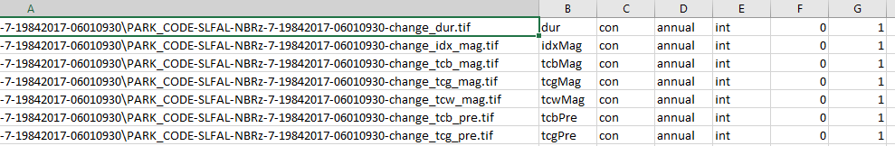 

3. In column A add the file path to the TIF file you added in step 1

4. In column B add the name that you want to represent that field. (for a DEM use Elev for elevation or IR for infrared reflectance.)

5. In column C add "con". 

6. In column D add "static".

7. In column E add "int"

8. In column F add the band number for the raster being used. If the raster has more than one band and you would like to add the attributes from the other bands to the polygons repeat steps 1 through 9 for each band. (example below)

9. In column G and a "1" or “0” to turn the attribute on or off. If it is off it will not be added.

10. Once your done adding information to the table **SAVE **your changes and close the excel file and continue on.

## !!! Important !!!!!! Important !!!!!! Important !!!     For the meeting:

Open the file that is similar to this on you system/project:

<headFolder>\vector\change\PARK_CODE-MORA-NBRz-7-19842017-06010930-dist_info_11mmu_8con\PARK_CODE-MORA-NBRz-7-19842017-06010930-change_attributes.csv

You can open it in Excel or a programming-friendly text editor (Justin uses notepad++)

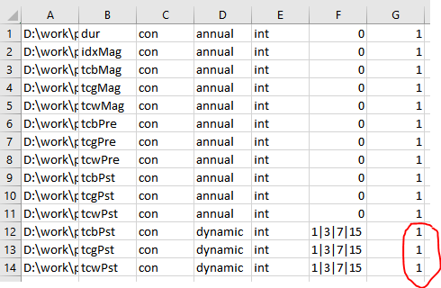

Change the red circled 1’s to 0s and save the file (keep format as csv). This file controls how what is summarized for polygons. This 7th column is an on/off switch, we’re going to turn off summarizing these three attributes because they take hours to complete.

## Append Zonal Statistics to Polygons

Type python in the prompt followed by a space and then drag in the *07_append_zonal_stats.py*  file* *from the *LT-ChangeDB *folder or type: 07 followed by the tab key to autocomplete find the file. The command should look like this:

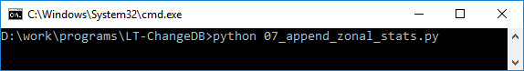

Example: >python 07_append_zonal_stats.py (if autocomplete worked)

...or

Example: >python D:\work\programs\LT-ChangeDB\07_append_zonal_stats.py

Hit enter and you’ll be asked to navigate to the project head folder.

You will get an error that can be ignored - does not affect the outputs:

<table>
  <tr>
    <td>*rasterstats\main.py:161: FutureWarning: Conversion of the second argument of issubdtype from `float` to `np.floating` is deprecated.</td>
  </tr>
</table>

The polygon files created in the previous step will be updated to include zonal summary stats for various attributes and two new files that are will be created, which are all of the individual year polygons merged into a single shapefile and a single spatialite geodatabase file  

Project Head

└───vector\change\<job>

distall.dbf

distall.prj

distall.shp

distall.shx

Project Head

└───vector\change\<job>

distall.sqlite

# TimeSync prep? 

# Make TC video?

# SQL Queries

Create a centroid shapefile for use in TimeSync

<table>
  <tr>
    <td>SELECT ST_Centroid(geometry), uniqid, ST_x(ST_Centroid(geometry)) as x, ST_y(ST_Centroid(geometry)) as y FROM dist</td>
  </tr>
</table>

Add centroid xy to database

Save the selection as a shapefile

Find intersecting polygons

<table>
  <tr>
    <td>select a.ogc_fid as a_ogc_fid, b.ogc_fid as b_ogc_fid
From nbrz a, nbrz b
where a.ogc_fid < b.ogc_fid and st_intersects(a.geometry, b.geometry)</td>
  </tr>
</table>

Select all polygons with a year of detection equal to 2000

<table>
  <tr>
    <td>select * from nbrz where yod = 2000</td>
  </tr>
</table>

TODO: add a bunch more examples of queries

# Troubleshooting

From command prompt, print environmental variables: set

# Appendix

## Segmentation Raster File Names and Definitions

<table>
  <tr>
    <td>Filename</td>
    <td>Description</td>
  </tr>
  <tr>
    <td>*clear_pixel_count.tif</td>
    <td>A raster that describes the number of pixels that were included in the calculation of the composite for a given pixel per year. There are as many bands as there are years in the time series defined by the range inclusive of the startYear and endYear parameters. Band order from 1 to n corresponds to ascending year order. </td>
  </tr>
  <tr>
    <td>*ftv_tcb.tif</td>
    <td>Annual time series of Tasseled Cap Brightness that has been fit to the vertices (ftv) of a given project’s LandTrendr segmentation per pixel. It has as many bands as there are years in the time series defined by the range inclusive of the startYear and endYear parameters. Band order from 1 to n corresponds to ascending year order.</td>
  </tr>
  <tr>
    <td>*ftv_tcg.tif</td>
    <td>Annual time series of Tasseled Cap Greenness that has been fit to the vertices (ftv) of a given project’s LandTrendr segmentation per pixel. It has as many bands as there are years in the time series defined by the range inclusive of the startYear and endYear parameters. Band order from 1 to n corresponds to ascending year order. </td>
  </tr>
  <tr>
    <td>*ftv_tcw.tif</td>
    <td>Annual time series of Tasseled Cap Wetness that has been fit to the vertices (ftv) of a given project’s LandTrendr segmentation per pixel. It has as many bands as there are years in the time series defined by the range inclusive of the startYear and endYear parameters. Band order from 1 to n corresponds to ascending year order. </td>
  </tr>
  <tr>
    <td>*ftv_tcb_delta.tif</td>
    <td>A multi-band raster dataset that describes the Tasseled Cap Brightness difference from the prior year to the current year per pixel. It has as many bands as there are years in the time series defined by the range inclusive of the startYear and endYear parameters. Band order from 1 to n corresponds to ascending year order. Note that the first year of the time series has no delta since we don’t know what the prior year’s values are.</td>
  </tr>
  <tr>
    <td>*ftv_tcg_delta.tif</td>
    <td>A multi-band raster dataset that describes the Tasseled Cap Greenness difference from the prior year to the current year per pixel. It has as many bands as there are years in the time series defined by the range inclusive of the startYear and endYear parameters. Band order from 1 to n corresponds to ascending year order. Note that the first year of the time series has no delta since we don’t know what the prior year’s values are.</td>
  </tr>
  <tr>
    <td>*ftv_tcw_delta.tif</td>
    <td>A multi-band raster dataset that describes the Tasseled Cap Wetness difference from the prior year to the current year per pixel. It has as many bands as there are years in the time series defined by the range inclusive of the startYear and endYear parameters. Band order from 1 to n corresponds to ascending year order. Note that the first year of the time series has no delta since we don’t know what the prior year’s values are.</td>
  </tr>
  <tr>
    <td>*seg_rmse.tif</td>
    <td>A single band raster that describes the overall LandTrendr segmentation fit in terms of root mean square error to the original time series per pixel.</td>
  </tr>
  <tr>
    <td>*vert_fit_idx.tif</td>
    <td>A multi-band raster that describes the fitted vertex values for the LandTrendr segmentation index for each segmentation vertex per pixel. There are as many bands as there are maximum vertices as defined by the maxSegments LandTrendr parameter plus 1. Null vertex slots are filled by 0.</td>
  </tr>
  <tr>
    <td>*vert_fit_tcb.tif</td>
    <td>A multi-band raster that describes the fitted vertex values for Tasseled Cap Brightness for each LandTrendr segmentation vertex per pixel. There are as many bands as there are maximum vertices as defined by the maxSegments LandTrendr parameter plus 1. Null vertex slots are filled by 0.</td>
  </tr>
  <tr>
    <td>*vert_fit_tcg.tif</td>
    <td>A multi-band raster that describes the fitted vertex values for Tasseled Cap Greenness for each LandTrendr segmentation vertex per pixel. There are as many bands as there are maximum vertices as defined by the maxSegments LandTrendr parameter plus 1. Null vertex slots are filled by 0.</td>
  </tr>
  <tr>
    <td>*vert_fit_tcw.tif</td>
    <td>A multi-band raster that describes the fitted vertex values for Tasseled Cap Wetness for each LandTrendr segmentation vertex per pixel. There are as many bands as there are maximum vertices as defined by the maxSegments LandTrendr parameter plus 1. Null vertex slots are filled by 0.</td>
  </tr>
  <tr>
    <td>*vert_yrs.tif</td>
    <td>A multi-band raster that describes the year of each LandTrendr segmentation vertex per pixel. There are as many bands as there are maximum vertices as defined by the maxSegments LandTrendr parameter plus 1. Null vertex slots are filled by 0. </td>
  </tr>
</table>

## Annual Change Raster File Names and Definitions

These files are not really useful on their own. They are containers that make attributing change polygons with segment information efficient. They are multi-band GeoTIFF raster files with a band for each year that a change onset can be detected (changes cannot be detected until the second year of the time series). Each file describes some aspect of a change segment and correspond to each other. If for a given year and pixel, no change onset is detected, then the pixel value for the year/band across all files will be null. If, however, a change onset is detected for a given year/band the pixel across all files will be filled with attributes about the change, like, the year of change onset detection, the magnitude of change, the duration of change, the pre-change segment spectral value, and the post-change segment value. The spectral values include the index that LandTrendr segmented the time series on and tasseled cap brightness, greenness, and wetness (fit to the vertices of the the LandTrendr-segmented index). There is also a comma delimited file that describes this file that is used in the script 07_append_zonal_stats.py as a list of parameter arguments. It is described further in the [Attribute Controller](#heading=h.g06pygirthjs) section below.

<table>
  <tr>
    <td>Filename</td>
    <td>Description</td>
  </tr>
  <tr>
    <td>*change_attributes.csv</td>
    <td>A change polygon attribute control file. It contains a list of raster files that represent attributes to be summarized per polygon. It contains file paths  and arguments that instruct the program on how to handle the file. You can find more information about this file HERE</td>
  </tr>
  <tr>
    <td>*change_dur.tif</td>
    <td>The values in each band are either null (if there was no change onset detected for a given pixel for a given year/band) or the temporal duration (years) of a change segment identified as starting on a given year/band.  </td>
  </tr>
  <tr>
    <td>*change_idx_mag.tif</td>
    <td>The values in each band are either null (if there was no change onset detected for a given pixel for a given year/band) or the spectral delta (spectral change in units of the index that was used to segment the time series) of a change segment identified as starting on a given year/band.</td>
  </tr>
  <tr>
    <td>*change_tcb_mag.tif</td>
    <td>The values in each band are either null (if there was no change onset detected for a given pixel for a given year/band) or the spectral delta (spectral change in units of tasseled cap brightness) of a change segment identified as starting on a given year/band.</td>
  </tr>
  <tr>
    <td>*change_tcb_post.tif</td>
    <td>The values in each band are either null (if there was no change onset detected for a given pixel for a given year/band) or the spectral value (units of tasseled cap brightness) for the vertex defining the end of a change segment identified as starting on a given year/band.</td>
  </tr>
  <tr>
    <td>*change_tcb_pre.tif</td>
    <td>The values in each band are either null (if there was no change onset detected for a given pixel for a given year/band) or the spectral value (units of tasseled cap brightness) for the vertex defining the start of a change segment identified as starting on a given year/band.</td>
  </tr>
  <tr>
    <td>*change_tcg_mag.tif</td>
    <td>The values in each band are either null (if there was no change onset detected for a given pixel for a given year/band) or the spectral delta (spectral change in units of tasseled cap greenness) of a change segment identified as starting on a given year/band.</td>
  </tr>
  <tr>
    <td>*change_tcg_post.tif</td>
    <td>The values in each band are either null (if there was no change onset detected for a given pixel for a given year/band) or the spectral value (units of tasseled cap greenness) for the vertex defining the end of a change segment identified as starting on a given year/band.</td>
  </tr>
  <tr>
    <td>*change_tcg_pre.tif</td>
    <td>The values in each band are either null (if there was no change onset detected for a given pixel for a given year/band) or the spectral value (units of tasseled cap greenness) for the vertex defining the start of a change segment identified as starting on a given year/band.</td>
  </tr>
  <tr>
    <td>*change_tcw_mag.tif</td>
    <td>The values in each band are either null (if there was no change onset detected for a given pixel for a given year/band) or the spectral delta (spectral change in units of tasseled cap wetness) of a change segment identified as starting on a given year/band.</td>
  </tr>
  <tr>
    <td>*change_tcw_post.tif</td>
    <td>The values in each band are either null (if there was no change onset detected for a given pixel for a given year/band) or the spectral value (units of tasseled cap wetness) for the vertex defining the end of a change segment identified as starting on a given year/band.</td>
  </tr>
  <tr>
    <td>*change_tcw_pre.tif</td>
    <td>The values in each band are either null (if there was no change onset detected for a given pixel for a given year/band) or the spectral value (units of tasseled cap wetness) for the vertex defining the start of a change segment identified as starting on a given year/band.</td>
  </tr>
  <tr>
    <td>*change_yrs.tif</td>
    <td>The values in each band are either null (if there was no change onset detected for a given pixel for a given year/band) or the year that change onset was detected value for a change segment identified as starting on a given year/band.</td>
  </tr>
</table>

## Polygon Field Names and Definitions

Polygon attributes are defined in the *attributes.csv file found in the <project head>\vector\change\<run name> directory. During step 5 (script 05_extract_annual_change.py) it is copied to this location from the <project head>\raster\landTrendr\change\<run name> directory. It controls what get summarized for each polygon. By default, it is initially populated with information from segmentation, but you can add you own variables to the list, like elevation, slope, etc. 

### Attributes controller 

attributes.csv file column descriptions (no field names or header on the file)

<table>
  <tr>
    <td>Column Number  </td>
    <td>Description</td>
  </tr>
  <tr>
    <td>1</td>
    <td>Raster attribute data source</td>
  </tr>
  <tr>
    <td>2</td>
    <td>Attribute field name (max 10 characters)</td>
  </tr>
  <tr>
    <td>3</td>
    <td>Code for whether variable is continuous (con) or categorical (cat)</td>
  </tr>
  <tr>
    <td>4</td>
    <td>A switch for how the variable should be handled. Generally, if you add your own variables, you’ll use static which means that the raster band does not change depending on what the change polygon year of detection is</td>
  </tr>
  <tr>
    <td>5</td>
    <td>A code what what the datatype is - integer (int) or float (float)</td>
  </tr>
  <tr>
    <td>6</td>
    <td>Which band to use. O mean that the band should be tied to yod, a barred series indicates bands past yod’s band, and a single value > 0 mean use that band number from the source </td>
  </tr>
  <tr>
    <td>7</td>
    <td>A boolean switch to turn the summary attribute on (1) or off (0). If off (0), then the attribute will not be included in the shapefile </td>
  </tr>
</table>

*attributes.csv attribute field name description  

<table>
  <tr>
    <td>Attribute Code</td>
    <td>Attribution description</td>
    <td>Diagram Code</td>
  </tr>
  <tr>
    <td>yod</td>
    <td>The year of disturbance detection</td>
    <td>1</td>
  </tr>
  <tr>
    <td>annualID</td>
    <td>Sequential patch identification number per year. Values range from 1 to the total number of patches in a given year.  </td>
    <td>NA</td>
  </tr>
  <tr>
    <td>index</td>
    <td>The spectral index code from which LandTrendr spectral-temporal segmentation was based on</td>
    <td>NA</td>
  </tr>
  <tr>
    <td>uniqID</td>
    <td>Unique polygon ID - Concatenation of index, yod, and annualID</td>
    <td>NA</td>
  </tr>
  <tr>
    <td>durMn</td>
    <td>Change segment duration mean</td>
    <td>3</td>
  </tr>
  <tr>
    <td>durSd</td>
    <td>Change segment duration standard deviation</td>
    <td>3</td>
  </tr>
  <tr>
    <td>idxMagMn</td>
    <td>Spectral segmentation index change magnitude mean</td>
    <td>2</td>
  </tr>
  <tr>
    <td>idxMagSd</td>
    <td>Spectral segmentation index change magnitude standard deviation</td>
    <td>2</td>
  </tr>
  <tr>
    <td>tcbMagMn</td>
    <td>Tasseled cap brightness change magnitude mean</td>
    <td>2</td>
  </tr>
  <tr>
    <td>tcbidxMagSd</td>
    <td>Tasseled cap brightness change magnitude standard deviation</td>
    <td>2</td>
  </tr>
  <tr>
    <td>tcgMagMn</td>
    <td>Tasseled cap greenness change magnitude mean</td>
    <td>2</td>
  </tr>
  <tr>
    <td>tcgMagSd</td>
    <td>Tasseled cap greenness change magnitude standard deviation</td>
    <td>2</td>
  </tr>
  <tr>
    <td>tcwMagMn</td>
    <td>Tasseled cap greenness change magnitude mean</td>
    <td>2</td>
  </tr>
  <tr>
    <td>tcwMagSd</td>
    <td>Tasseled cap greenness change magnitude standard deviation</td>
    <td>2</td>
  </tr>
  <tr>
    <td>idxPreMn</td>
    <td>Spectral segmentation index pre-change mean</td>
    <td>4</td>
  </tr>
  <tr>
    <td>idxPreSd</td>
    <td>Spectral segmentation index pre-change standard deviation</td>
    <td>4</td>
  </tr>
  <tr>
    <td>tcbPreMn</td>
    <td>Tasseled cap brightness pre-change mean</td>
    <td>4</td>
  </tr>
  <tr>
    <td>tcbPreSd</td>
    <td>Tasseled cap brightness pre-change standard deviation</td>
    <td>4</td>
  </tr>
  <tr>
    <td>tcgPreMn</td>
    <td>Tasseled cap greenness pre-change mean</td>
    <td>4</td>
  </tr>
  <tr>
    <td>tcgPreSd</td>
    <td>Tasseled cap greenness pre-change standard deviation</td>
    <td>4</td>
  </tr>
  <tr>
    <td>tcwPreMn</td>
    <td>Tasseled cap wetness pre-change mean</td>
    <td>4</td>
  </tr>
  <tr>
    <td>tcwPreSd</td>
    <td>Tasseled cap wetness pre-change standard deviation</td>
    <td>4</td>
  </tr>
  <tr>
    <td>tcbPstMn</td>
    <td>Tasseled cap brightness post-change mean</td>
    <td>5</td>
  </tr>
  <tr>
    <td>tcbPstSd</td>
    <td>Tasseled cap brightness post-change standard deviation</td>
    <td>5</td>
  </tr>
  <tr>
    <td>tcgPstMn</td>
    <td>Tasseled cap greenness post-change mean</td>
    <td>5</td>
  </tr>
  <tr>
    <td>tcgPstSd</td>
    <td>Tasseled cap greenness post-change standard deviation</td>
    <td>5</td>
  </tr>
  <tr>
    <td>tcwPstMn</td>
    <td>Tasseled cap wetness post-change mean</td>
    <td>5</td>
  </tr>
  <tr>
    <td>tcwPstSd</td>
    <td>Tasseled cap wetness post-change standard deviation</td>
    <td>5</td>
  </tr>
  <tr>
    <td>area</td>
    <td>Patch area (meters square)</td>
    <td>NA</td>
  </tr>
  <tr>
    <td>perim</td>
    <td>Patch perimeter (m)</td>
    <td>NA</td>
  </tr>
  <tr>
    <td>Shape</td>
    <td>A measure of patch shape complexity (perimeter of patch divided by the perimeter of a circle with the same area as the patch)</td>
    <td>NA</td>
  </tr>
  <tr>
    <td>tcbPst--Mn</td>
    <td>Tasseled cap brightness post-change xx years mean </td>
    <td>6, 7, 8, 9</td>
  </tr>
  <tr>
    <td>tcbPst--Sd</td>
    <td>Tasseled cap brightness post-change xx years standard deviation</td>
    <td>6, 7, 8, 9</td>
  </tr>
  <tr>
    <td>tcgPst--Mn</td>
    <td>Tasseled cap greenness post-change xx years mean </td>
    <td>6, 7, 8, 9</td>
  </tr>
  <tr>
    <td>tcgPst--Sd</td>
    <td>Tasseled cap greenness post-change xx years standard deviation</td>
    <td>6, 7, 8, 9</td>
  </tr>
  <tr>
    <td>tcwPst--Mn</td>
    <td>Tasseled cap greenness post-change xx years mean </td>
    <td>6, 7, 8, 9</td>
  </tr>
  <tr>
    <td>tcwPst--Sd</td>
    <td>Tasseled cap greenness post-change xx years standard deviation</td>
    <td>6, 7, 8, 9</td>
  </tr>
</table>

Diagram of a segmented pixel time series showing the attributes regarding a segment of interest. Attributed codes are referenced in the above table: *attributes.csv attribute field name description  

[http://www.gaia-gis.it/gaia-sins/windows-bin-amd64/](http://www.gaia-gis.it/gaia-sins/windows-bin-amd64/)

[http://www.gaia-gis.it/gaia-sins/windows-bin-amd64/spatialite_gui-4.3.0a-win-amd64.7z](http://www.gaia-gis.it/gaia-sins/windows-bin-amd64/spatialite_gui-4.3.0a-win-amd64.7z)

SELECT *, ST_IsValidReason(geometry)

FROM dist1992

WHERE NOT ST_IsValid(geometry)

# References

Crist, E. P. (1985). A tm tasseled cap equivalent transformation for reflectance factor data. Remote Sensing of Environment, 17(3):301–306.

Kennedy, R. E., Yang, Z., & Cohen, W. B. (2010). Detecting trends in forest disturbance and recovery using yearly Landsat time series: 1. LandTrendr—Temporal segmentation algorithms. Remote Sensing of Environment, 114(12), 2897-2910.

