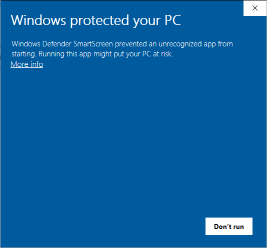

# LandTrendrPyEnv
{:.no_toc}

## Table of contents
{:.no_toc .text-delta}

* TOC
{:toc}

## About 

**LandTrendrPyEnv** is an isolated, independent Python programming environment that does not disrupt any other 
Python installation on your system or set any environmental variables. It contains only the Python libraries 
and dependencies that are required for running scripts for working with LandTrendr outputs from Google Earth Engine.

It is distributed and installed as a **Windows 64-bit.exe**, which unzips a series of folders 
and files into a given directory.

The programming environment is accessed via a special command prompt that is started by opening a Windows batchfile - 
**Start_LandTrendrPyEnv.bat**.  

## Install LandTrendrPyEnv

### Downloading

The **LandTrendrPyEnv installer** can be downloaded using this FTP link:

[https://github.com/eMapR/LT-ChangeDB/releases/download/v1.0/LandTrendrPyEnv-0.4-Windows-x86_64.exe](https://github.com/eMapR/LT-ChangeDB/releases/download/v1.0/LandTrendrPyEnv-0.4-Windows-x86_64.exe)

Visiting the link will prompt a download of the file - it will download to your **Downloads directory** or wherever 
you have set your browser to store downloaded files.

### Installation walk-through

Find the file that you just downloaded (**LandTrendrPyEnv-0.4-Windows-x86_64.exe**) and double click on it to 
start the installation process. If you are concerned about the reversibility of this installation, don’t worry, 
there is an uninstaller included with the installation, and the program will not change anything about your 
system’s registry or environmental variables. The uninstaller can be found by going to the install/uninstall 
application on your system and searching for the Python installation of LandTrendrPyEnv.

1. **Run the executable**

You might be presented with a security warning. Allow the program to **Run**




You could see difference messages depending on your system. If you do not see a "Run" button you might need to click 
on a **"More info"** (or similar) link to access a the **"Run"** or **"Run anyway"** button. 

2. **Start installation and agree to Conda terms**


3. **Who to install for**

Select: **"Just Me"**


4. **Where to install**

As mentioned in the [Directory Setup](https://emapr.github.io/LT-ChangeDB/docs/directory_setup.html) section, 
you can install this wherever you wish, but for the purpose of 
the guide, we’ll install it in the **C:\LandTrendrGEE** folder we created in the previous step. We want the 
program’s folder to be called **LandTrendrPyEnv**, so, putting the paths together we end up with a 
destination folder:

```
C:\LandTrendrGEE\LandTrendrPyEnv
```

Note that you should have write privilege to this path and that there should be no spaces in the path (don’t 
put it in "My Documents", for instance). Enter the desired path as the **destination folder** in the **setup prompt**. 
Additionally, note or save the path to a text file or in a open Notepad window, because we need to set it as a 
variable in **.bat file** in a following step. Hit the **Next** button.


1. **Advanced options**

Do not check either option


Install starts


Install completes


You should now have a **LandTrendrPyEnv folder** wherever you set the **Destination Folder** in the prompt. Look for the folder 
to verify its location. If you can’t find it, hit the **Windows key** and do a search for **LandTrendrPyEnv**. If 
it is not at the location specified in the prompt, then you’ll need to uninstall and reinstall the program and make sure to set the 
**Destination Folder** in the prompt correctly.

> DON’T PUT ANY FILES IN THIS **LandTrendrPyEnv FOLDER**, IF YOU EVER NEED TO UNINSTALL IT, IT MIGHT THINK 
> THAT THERE IS A VIRUS ASSOCIATED WITH THE PROGRAM BECAUSE THERE ARE FILES NOT RECOGNIZED AS BEING INSTALLED 
> BY THE INSTALLER OR CONDA. IF THIS HAPPENS IT MAY QUARANTINE THE PROGRAM AND YOU’LL NEED TO FIND THE FILES 
> THAT WERE ADDED AND DELETE THEM BEFORE TRYING TO UNINSTALL AGAIN.

## Uninstall LandTrendrPyEnv

If you ever need to uninstall **LandTrendrPyEnv** you can use its **uninstaller .exe** within the **LandTrendrPyEnv folder**,
or by going to the install/uninstall application on your system and searching for the Python installation of **LandTrendrPyEnv**. 
It will remove the **LandTrendrPyEnv folder** and all its contents from your system and remove it from the list of 
installed programs (it is recognized as a Python version)

## Mac or Linux system (Anaconda)

If you are on a Mac or Linux system you won’t be able to install **LandTrendrPyEnv** because it is for **Window OS** 
only. However, you can replicate the environment through Anaconda instead. It is best to do everything through 
**Anaconda Prompt** (search your applications for it). You'll want to create a new virtual environment, so that you don’t 
mess up any versioning in your base environment. 

1. Make sure you have the **conda-forge channel** 

```
conda config --append channels https://conda.anaconda.org/conda-forge/
```

2. Install the following libraries in a new Python 2.7 **LandTrendrPyEnv** environment:

- pandas
- rasterio
- rasterstats
- shapely
- fiona
- gdal

```
conda create -n LandTrendrPyEnv python=2.7 gdal=2.1 pandas rasterio rasterstats shapely=1.6.4 fiona=1.7.9 
```

# Scripts

## About

All of the local data processing (post-processing the Earth Engine raster change data) 
is done using Python. There are a series of Python scripts that automate much of the work-flow. You need 
to download the scripts to your system from a GitHub repository. 

## Get Scripts

Visit the following URL:

[https://github.com/eMapR/LT-ChangeDB   ](https://github.com/eMapR/LT-ChangeDB)

Download the reposility as a zip file 


A file titled **LT-ChangeDB-master.zip** will be downloaded to your computer. Find the file in your 
**Downloads** directory or wherever you have your browser set to stored downloaded files.

The files in this zip archive can be thought of as program files - the program **LT-ChangeDB** stands 
for LandTrendr Change Database. Unzip the **LT-ChangeDB-master.zip** file to the **LandTrendrGEE** folder 
that was set up in the **[Directory Setu**p](#heading=h.7k7uc2kddhr9) section and rename the folder to 
**LT-ChangeDB**. You now should have a directory that looks similar to this:

```
C:\LandTrendrGEE
├───LandTrendrPyEnv
└───LT-ChangeDB
```

The contents of the **LT-ChangeDB** should look like this:

```
C:\LandTrendrGEE\LT-ChangeDB
│   01_dependency_check.py
│   02_project_setup.py
│   03_vector_setup.py
│   04_unpack_lt_ee_data.py
│   05_extract_annual_change.py
│   06_make_polygons.py
│   07_append_zonal_stats.py
│   08_make_tc_video.py
│   ltcdb.py
│   ltcdb.pyc
│   README.md
│   Start_LandTrendrPyEnv.bat
│   tc_time_series.html
│
└───LandTrendrPyEnv_setup
```

These files need to stay together. Nothing from this folder should be modified and nothing should be added 
to this folder. When we run python commands to post-process LandTrendr data from GEE the command prompt 
will look to this folder to find scripts to run. It should be noted that is directory can be placed 
anywhere and be called anything, but for the purpose of standardizing this guide, it is being placed 
in the **LandTrendrGEE **folder at the same level as the **LandTrendrPyEnv** folder.

## Setting Up the LandTrendrPyEnv Prompt

A special command prompt is included in the **LT-ChangeDB** folder. This special prompt is opened by 
double clicking on the **Start_LandTrendrPyEnv.bat** file in the **LT-ChangeDB** folder from the 
above step (don’t start it yet). It is how we will run all the scripts in the **LT-ChangeDB** folder. 
It is special because it will only know about files in the **LandTrendrPyEnv*** *folder and **LT-ChangeDB** 
folder, and it does not add anything to your system’s environmental variables or registry - 
it is totally isolated from from other installs of python. However, for it to know about files 
in the **LandTrendrPyEnv** folder, we have to tell it where the folder is located on your system.

1. Open the **Start_LandTrendrPyEnv.bat** file from the **LT-ChangeDB** folder in Microsoft 
WordPad for editing. You can try right clicking on the file and select WordPad as an option under 
"open with", if given the option, or open the WordPad application and then open the file from within 
WordPad (you may have to set the file search to “All Documents (*.*)” in order to see the .bat file). 
Note that Notepad should not be used as a text editor in this case because it does not read the new 
line returns correctly. Notepad++ is a good alternative general purpose text editor that could be 
used as well, though it needs to be downloaded and installed.

2. Edit the text area highlighted in blue in the figure below so that it is the path of the **LandTrendrPyEnv** 
installation folder. If there are any spaces in the path to the **LandTrendrPyEnv*** *installation folder, 
you should be able to enclose the path with double quotes (there seems to be some inconsistencies in 
success with using quotes among systems - it is best if the path has no spaces). Leave no space between 
the "=" sign and the path.

**Start_LandTrendrPyEnv.bat** before editing:


Reminder of the directory that we want the path to bolded:

```
C:\LandTrendrGEE
├───**LandTrendrPyEnv**
└───LT-ChangeDB
```

**Start_LandTrendrPyEnv.bat** after editing:


3) Save the file to it original location and name - overwrite the original.

Double click on the **Start_LandTrendrPyEnv.bat** file to start the  **LandTrendrPyEnv Prompt**. 
You should get a window like the one below showing the current working directory. We’ll interact 
with it by typing python followed by the path to a script we want to execute.

Here is what the **LandTrendrPyEnv Prompt** should look like once opened.


4) Type python into the **LandTrendrPyEnv Prompt** to see if it can find the **LandTrendrPyEnv** 
Python install. If it worked, you’ll get a python command line:


If something failed you’ll get a window that looks like this:


If it** **did fail check all your paths - relocate the **LandTrendrPyEnv** install older and make 
sure that it matches exactly what you set as the LT_PY_ENV variable when editing the **Start_LandTrendrPyEnv.bat** file.
