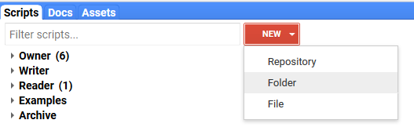
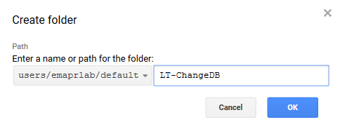
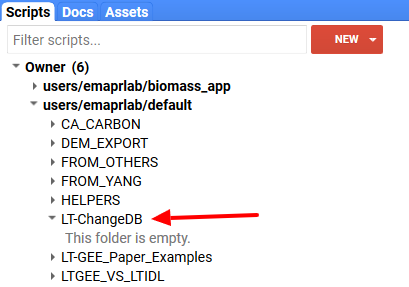

# Create an LT-ChangeDB script folder
{:.no_toc}

## Table of contents
{:.no_toc .text-delta}

* TOC
{:toc}

In a following step you’ll be making a copy of a master script to generate segmentation data. 
You’ll need a place to put this script copy that is writable by you.

1. Within the GEE IDE under the **Scripts** tab click on the **NEW **button to release a 
dropdown menu - select the **Folder** option

1. A new window will appear asking you to define the repository and the new folder’s name. 
In this example, the repository is selected as the default and we’ve named the new folder **LT-ChangeDB**. Hit the **OK** button when you’re done.

You’ll now see the new folder in the repository that you selected. This folder is where you’ll 
copy and save your personal scripts to.

