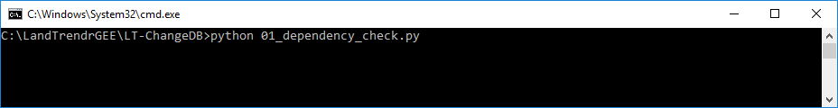
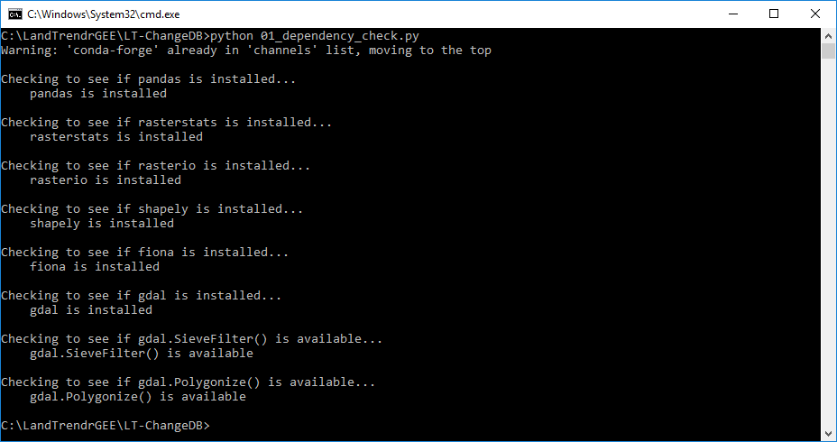

# Dependency Check
{:.no_toc}

## Table of contents
{:.no_toc .text-delta}

* TOC
{:toc}

## About

To ensure that **LandTrendrPyEnv** was installed correctly and contains the Python libraries required by 
**LT-ChangeDB** scripts, we can run a test to check.

## Check for required libraries

We check for libraries by running a script from the **LandTrendrPyEnv Prompt**. We’ll run a script to 
test for dependencies. If the python command line is still open from the previous step (designated as: >>>), 
then type: exit() into the prompt and hit enter to close the python interpreter. Alternatively, close 
the **LandTrendrPyEnv Prompt** and open a new one by double-clicking the **Start_LandTrendrPyEnv.bat file** 
in the **LT-ChangeDB folder**.

The script to test dependencies is called **01_dependency_check.py**. It is found in the **LT-ChangeDB** 
program files folder. To run it type python  followed by a space in the command line of the **LandTrendrPyEnv Prompt** 
and then type `01` and hit the tab key to autocomplete the filename. If the file was not found by autocomplete, 
then drag the **01_dependency_check.py** file into the command line, which will append the file’s path to the 
current command. The command line should look similar to this now:

[//]: # ()

Example with relative path (autocomplete):

```
python 01_dependency_check.py
```

Example with full path (file drag and drop): 

```
python C:\LandTrendrGEE\LT-ChangeDB\01_dependency_check.py
```

Note that if your path has any spaces in it, the path in the command line should be enclosed by quotations, 
so that it is interpreted as a single string of text - this is only relevant if you manually type the script 
file name. Using either autocomplete or drag and drop will automatically add quotes if needed. See the following 
example where one of the folders is called "misc programs", in which case quotations are needed around the entire file path

Example: 

```
python "C:\misc programs\LT-ChangeDB\01_dependency_check.py"
```


Before you hit enter, make sure that the prompt is the active application, if you drag in a file to the prompt, 
generally Windows Explorer is the active application, so just click on the top bar of the **LandTrendrPyEnv Prompt**, 
then hit the enter key to start the program.

If everything is okay with dependencies you should get a message like this:



Where it says that each library checked **is** installed. If there were any missing libraries, the message would 
read **is not** installed. Since this **LandTrendrPyEnv** is pre-packaged, there should be no problems, but this 
is just a good test of the system.

If it fails on any library, contact Justin Braaten ([jstnbraaten@gmail.com](mailto:jstnbraaten@gmail.com)) to 
find out what to do.