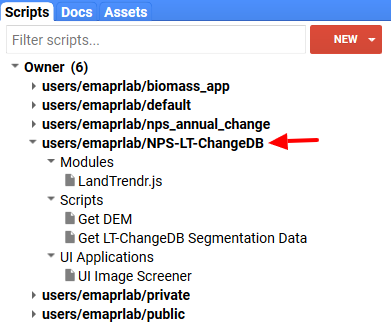
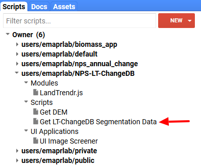
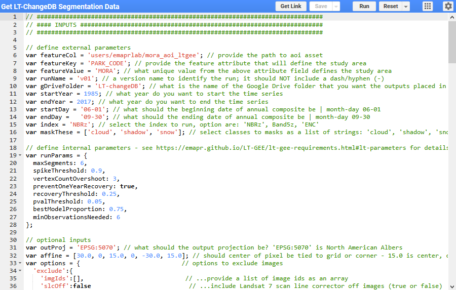
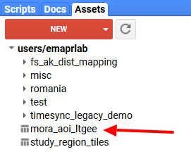
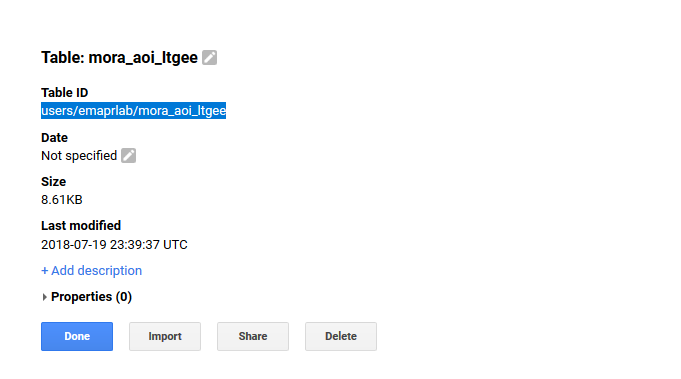
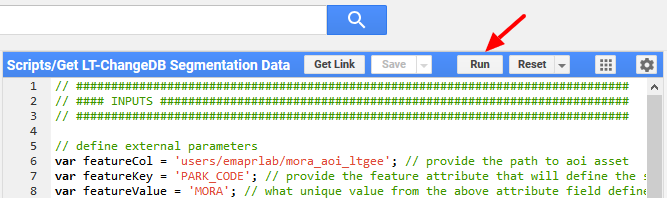
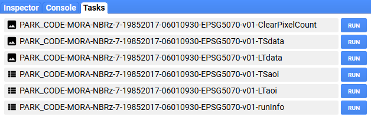
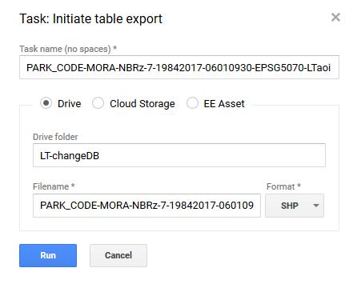
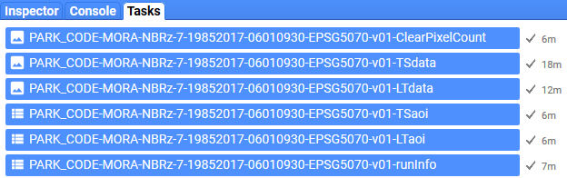

# Generate LandTrendr Data
{:.no_toc}

## Table of contents
{:.no_toc .text-delta}

* TOC
{:toc}

We’ll run LT-GEE (LandTrendr on Google Earth Engine) to segment a selected Landsat spectral time series band or index and then fit to the vertices that are identified, tasseled cap brightness, greenness, and wetness (Crist, 1985). All of the data necessary for populating an annual change database will be assembled in a single image with >100 bands that will be exported to the Google Drive account associated with your EE account and then downloaded locally.

1. Open the GEE [IDE](https://code.earthengine.google.com/) and expand the **user/emaprlab/NPS-LT-ChangeDB** repository in the **Scripts** tab found on the left panel. Note that the repository will be under your **Reader **directory.

2. Copy the master **Get LT-ChangeDB Segmentation Data** script file found in the **Scripts** subfolder to the **LT-ChangeDB** folder you created in a previous step, so you can edit and save it (the master copy is read only and used as a template by everyone using this system). To copy the file: click, hold, and drag the file from **user/emaprlab/NPS-LT-ChangeDB:Scripts/** repository to your **LT-ChangeDB **folder.

3. Click on the **Get LT-ChangeDB Segmentation Data** script file you just copied to your **LT-ChangeDB **folder. When it loads in the editor it will look like this:

1. There are two sections to this script file: an **inputs** section and a **processing **section. You’ll edit the parameters in the **inputs **section to define the area to run LandTrendr on, over what period of years, over what season, what to mask, how to perform segmentation, and optionally set output coordinate reference information, as well as excluding images.

2. Edit the inputs as desired. Use the following tables of definitions to help you set the parameters.

## Collection building parameters

The following parameters control the building of annual image collections that are composited and provided as input to LandTrendr for spectral-temporal segmentation.

<table>
  <tr>
    <td>Parameter</td>
    <td>Type</td>
    <td>Definition</td>
  </tr>
  <tr>
    <td>featureCol*</td>
    <td>String</td>
    <td>The path to the area of interest file that was uploaded in a previous step. See the instructions* below for identifying the path. </td>
  </tr>
  <tr>
    <td>featureKey</td>
    <td>String</td>
    <td>The feature attribute that will define the study area over which to run LandTrendr. A field name from the attribute table of the uploaded shapefile. See Vector Setup section.</td>
  </tr>
  <tr>
    <td>featureValue</td>
    <td>String</td>
    <td>The value from the attribute field set as featureKey that defines  the study area over which to run LandTrendr. See Vector Setup section. </td>
  </tr>
  <tr>
    <td>runName</td>
    <td>String</td>
    <td>A unique name for this LandTrendr/project run. Example 'v1' (you might want to try different parameters sets, in which case you might have several versions: v1, v2, v3, etc). It should not contain any hyphens (-) or special characters besides underscore (_).</td>
  </tr>
  <tr>
    <td>gDriveFolder</td>
    <td>gDriveFolder</td>
    <td>The name of the Google Drive folder that the resulting data will be sent to. If the folder does not exist, it will be created on-the-fly. It will not write to subfolder of your Google Drive. The folder with either be created at the first level or must exist at the first level.</td>
  </tr>
  <tr>
    <td>startYear </td>
    <td>Integer</td>
    <td>The start year of the annual time series over which LandTrendr will operate.</td>
  </tr>
  <tr>
    <td>endYear </td>
    <td>Integer</td>
    <td>The end year of the annual time series over which LandTrendr will operate.</td>
  </tr>
  <tr>
    <td>startDay </td>
    <td>String</td>
    <td>The minimum date in the desired seasonal range over which to generate annual composite. Formatted as 'mm-dd'.</td>
  </tr>
  <tr>
    <td>endDay </td>
    <td>String</td>
    <td>The maximum date in the desired seasonal range over which to generate annual composite. Formatted as 'mm-dd'.</td>
  </tr>
  <tr>
    <td>index </td>
    <td>String</td>
    <td>The spectral index or band from the list of index codes to be segmented by LandTrendr.</td>
  </tr>
  <tr>
    <td>maskThese</td>
    <td>List</td>
    <td>A list of strings that represent names of images features to mask. Features can include 'cloud', 'shadow', 'snow', 'water'.</td>
  </tr>
</table>

**FeatureCol* parameter: this is defined as the path to the shapefile asset you uploaded to GEE in a [previous step](#heading=h.qv236ea764hk). To get the path, open the **Assets **tab found in the left panel of the GEE IDE, click on the AOI file name you’d like to use, which will open up a metadata window, copy the **Table ID** and paste it as the **FeatureCol** parameter argument

### LandTrendr spectral indices

The following table lists the Landsat-based spectral indices and transformations that are available to run LandTrendr on.

<table>
  <tr>
    <td>Code</td>
    <td>Name</td>
    <td>Disturbance delta </td>
  </tr>
  <tr>
    <td>NBR</td>
    <td>Normalized Burn Ratio</td>
    <td>-1</td>
  </tr>
  <tr>
    <td>NDVI</td>
    <td>Normalized Difference Vegetation Index</td>
    <td>-1</td>
  </tr>
  <tr>
    <td>NDSI</td>
    <td>Normalized Difference Snow Index</td>
    <td>-1</td>
  </tr>
  <tr>
    <td>NDMI</td>
    <td>Normalized Difference Moisture Index</td>
    <td>???</td>
  </tr>
  <tr>
    <td>TCB</td>
    <td>Tasseled-Cap Brightness</td>
    <td>1</td>
  </tr>
  <tr>
    <td>TCG</td>
    <td>Tasseled-Cap Greenness</td>
    <td>-1</td>
  </tr>
  <tr>
    <td>TCW</td>
    <td>Tasseled-Cap Wetness</td>
    <td>-1</td>
  </tr>
  <tr>
    <td>TCA</td>
    <td>Tasseled-Cap Angle</td>
    <td>-1</td>
  </tr>
  <tr>
    <td>B1</td>
    <td>Thematic Mapper-equivalent Band 1</td>
    <td>1</td>
  </tr>
  <tr>
    <td>B2</td>
    <td>Thematic Mapper-equivalent Band 2</td>
    <td>1</td>
  </tr>
  <tr>
    <td>B3</td>
    <td>Thematic Mapper-equivalent Band 3</td>
    <td>1</td>
  </tr>
  <tr>
    <td>B4</td>
    <td>Thematic Mapper-equivalent Band 4</td>
    <td>-1</td>
  </tr>
  <tr>
    <td>B5</td>
    <td>Thematic Mapper-equivalent Band 5</td>
    <td>1</td>
  </tr>
  <tr>
    <td>B7</td>
    <td>Thematic Mapper-equivalent Band 7</td>
    <td>1</td>
  </tr>
  <tr>
    <td>B5z</td>
    <td>Thematic Mapper-equivalent Band 5 standardized to mean 0 and stdev 1</td>
    <td>1</td>
  </tr>
  <tr>
    <td>NBRz</td>
    <td>Normalized Burn Ratio standardized to mean 0 and stdev 1</td>
    <td>1</td>
  </tr>
  <tr>
    <td>ENC</td>
    <td>6 band composite - mean of z-score: [B5, B7, TCW, TCA, NDMI, NBR]</td>
    <td>1</td>
  </tr>
</table>

## LandTrendr segmentation parameters

The following parameters control how LandTrendr performs spectral-temporal segmentation. Besides the following parameter definitions, more information and context can be found in the original paper describing LandTrendr ([Kennedy et al, 2010](http://geotrendr.ceoas.oregonstate.edu/files/2015/05/Kennedy_etal2010.pdf))

<table>
  <tr>
    <td>Parameter</td>
    <td>Type</td>
    <td>Default</td>
    <td>Definition</td>
  </tr>
  <tr>
    <td>maxSegments</td>
    <td>Integer</td>
    <td> </td>
    <td>Maximum number of segments to be fitted on the time series</td>
  </tr>
  <tr>
    <td>spikeThreshold</td>
    <td>Float</td>
    <td>0.9</td>
    <td>Threshold for dampening the spikes (1.0 means no dampening)</td>
  </tr>
  <tr>
    <td>vertexCountOvershoot</td>
    <td>Integer</td>
    <td>3</td>
    <td>The initial model can overshoot the maxSegments + 1 vertices by this amount. Later, it will be pruned down to maxSegments + 1</td>
  </tr>
  <tr>
    <td>preventOneYearRecovery</td>
    <td>Boolean</td>
    <td>FALSE</td>
    <td>Prevent segments that represent one year recoveries</td>
  </tr>
  <tr>
    <td>recoveryThreshold</td>
    <td>Float</td>
    <td>0.25</td>
    <td>If a segment has a recovery rate faster than 1/recoveryThreshold (in years), then the segment is disallowed</td>
  </tr>
  <tr>
    <td>pvalThreshold</td>
    <td>Float</td>
    <td>0.1</td>
    <td>If the p-value of the fitted model exceeds this threshold, then the current model is discarded and another one is fitted using the Levenberg-Marquardt optimizer</td>
  </tr>
  <tr>
    <td>bestModelProportion</td>
    <td>Float</td>
    <td>1.25</td>
    <td>Takes the model with most vertices that has a p-value that is at most this proportion away from the model with lowest p-value</td>
  </tr>
  <tr>
    <td>minObservationsNeeded</td>
    <td>Integer</td>
    <td>6</td>
    <td>Min observations needed to perform output fitting</td>
  </tr>
</table>

## Optional Parameters

<table>
  <tr>
    <td>Parameter</td>
    <td>Type</td>
    <td>Definition</td>
  </tr>
  <tr>
    <td>outProj</td>
    <td>String</td>
    <td>The desired projection of the output GeoTIFFs defined as an EPSG code with the format ‘EPSG:####’. Master script defaults to Albers Equal Area Conic for North America </td>
  </tr>
  <tr>
    <td>affine</td>
    <td>List of floating point values</td>
    <td>Option to define whether the pixel grid is tied to the center or corners of pixels. The third and sixth values determine the position. Use 15.0 to align center of pixels to the grid or 0.0 for pixel corners to be tied to the grid. The master script defaults to 15.0 (pixel center snaps to grid, which is what USGS NLCD products use).  </td>
  </tr>
  <tr>
    <td>options</td>
    <td>Dictionary of options </td>
    <td>An option to exclude images either by defining a list of image IDs and or excluding Landsat ETM+ scan line corrector off images(images with gaps in data). See the master script for an example of parameter structure. options.exclude.imgIds requires a list of image id strings (defaults to no image exclusion). options.exclude.slcOff requires a Boolean of either false or true for whether to exclude Landsat ETM+ SLC-off images (defualts to false). Image IDs can be obtained from the UI Image Screener app  </td>
  </tr>
</table>

3. After all the parameters are set, hit the **Run** button at the top of the script panel of the GEE IDE. In a moment the **Tasks** tab in the right panel of the IDE will turn orange alerting you to jobs that need to be started (if it doesn’t appear to be working, be patience a couple minutes). Activate the **Tasks** tab and you should see six jobs that need to be started. The job names provide information about the LandTrendr run. The last file parts distinguish the type of data that will be generated from the GEE script and output to Google Drive.

The following sections describes what each job/file is.

## Output Description

### File name description key

Each file contains information about the LandTrendr run, both for your information and for the coming Python scripts to decide how to handle the various files. Therefore, you should not change files names. The files contain 8 pieces of information, each separated by a hyphen. The key below describes what each pieces represents.

File string part key: AA-BB-CC-DD-EE-FF-GG-HH

<table>
  <tr>
    <td>File name part</td>
    <td>Description</td>
  </tr>
  <tr>
    <td>AA</td>
    <td>featureKey (from the collection building parameters)</td>
  </tr>
  <tr>
    <td>BB</td>
    <td>featureValue (from the collection building parameters)</td>
  </tr>
  <tr>
    <td>CC</td>
    <td>index (from the collection building parameters)</td>
  </tr>
  <tr>
    <td>DD</td>
    <td>concatenation(startYear, endYear) format: yyyy|yyyy (from the collection building parameters)</td>
  </tr>
  <tr>
    <td>EE</td>
    <td>concatenation(startDay, endDay) format: mmdd|mmdd (from the collection building parameters)</td>
  </tr>
  <tr>
    <td>FF</td>
    <td>runName (from the collection building parameters)</td>
  </tr>
  <tr>
    <td>GG</td>
    <td>outProj (from the collection building parameters)</td>
  </tr>
  <tr>
    <td>HH*</td>
    <td>Data type, see next table (autogenerated)</td>
  </tr>
</table>

*The following table describes the six different data files that are generated 

<table>
  <tr>
    <td>Data type</td>
    <td>Description</td>
  </tr>
  <tr>
    <td>ClearPixelCount</td>
    <td>A multi-band GeoTIFF file that provides a count of the number of pixels that went into generating each annual composite.</td>
  </tr>
  <tr>
    <td>TSdata</td>
    <td>A multi-band GeoTIFF TimeSync-Legacy data stack.</td>
  </tr>
  <tr>
    <td>LTdata</td>
    <td>A multi-band GeoTIFF LandTrendr segmentation data stack.</td>
  </tr>
  <tr>
    <td>TSaoi</td>
    <td>A shapefile that defined the area run for TimeSync-Legacy data generation. It is buffed out a little from the original file and will be in the projection defined by the outProj parameter.</td>
  </tr>
  <tr>
    <td>LTaoi</td>
    <td>A shapefile that defined the area run for LandTrendr segmentation data generation. It is buffed out 300m (10 pixels) from the original file and will be in the projection defined by the outProj parameter.</td>
  </tr>
  <tr>
    <td>runInfo</td>
    <td>CSV file containing metadata about the LandTrendr run.</td>
  </tr>
</table>

1. Click the **Run **button following each job. After clicking **Run** on a job you’ll be prompted by a window asking you to confirm aspects of the job - click **Run**. Little gears will start to turn next to the jobs, indicating that the job is being processed. You can start all the jobs concurrently - no need to wait for one to finish before starting the next. 

When the jobs finish, the job title box will turn blue and a check mark and time to completion will appear following. Wait until all jobs complete and then proceed to the next step of downloading the data. Each file type will be exported as either GeoTIFF, shapefile, or csv to the Google Drive folder you specified in the collection building parameters.

