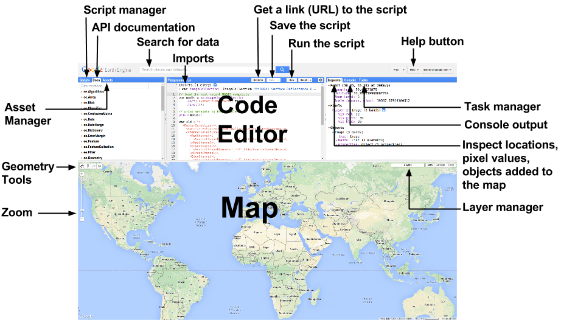

# Google Earth Engine Setup
{:.no_toc}

## Table of contents
{:.no_toc .text-delta}

* TOC
{:toc}

## Access

We’ll be using [Google Earth Engine](https://earthengine.google.com/) (GEE) to run LandTrendr 
([LT-GEE](https://github.com/eMapR/LT-GEE)). GEE requires that a Google-associated email account 
be granted access. If you don’t have GEE access you can request it here: 

[https://signup.earthengine.google.com/#!/](https://signup.earthengine.google.com/#!/)

If you need to sign up, you’ll be asked what you intend to do with Earth Engine. I’ve not heard of 
anyone being denied access, but make your response compelling.

We’ll be using the GEE JavaScript API. Here is a link to the API User Guide for reference: 
[https://developers.google.com/earth-engine/](https://developers.google.com/earth-engine/)

The JavaScript GEE code editor (IDE) can be accessed here:

[https://code.earthengine.google.com/](https://code.earthengine.google.com/)

The first time you access the code editor, you will probably be prompted to setup a default user code 
repository. The eMapR lab default code repository, for instance, is *users/***_emaprlab_***/default*. The 
default code repository might be suggested from your email, however, you may need to, or optionally define it. 
If you are required or choose to define it, make it short and reasonably representative/descriptive of you as a 
user or organization - it likely has to be unique.

## Exploration

1. Get comfortable with the JavaScript GEE IDE, move panel sliders, click on tabs, expand script libraries and documentation. 

2. Within the **Script Manager **tab, expand the **Examples** repository and run through some of the example 
for Images, Image Collection, and Feature Collection.

3. When working on examples, zoom, pan, and click (view the Inspector tab), and watch for things printed to the console

## Add required repositories

We have a series of scripts and applications that you need to add to your GEE account. Visit these 
URL links to add required scripts to your GEE account:

The following link adds generic scripts and functions for using LandTrendr to your script library. 
It will show up under your **Reader **repository under the **Scripts** tab in the left panel of the GEE IDE

[https://code.earthengine.google.com/?accept_repo=users/emaprlab/public](https://code.earthengine.google.com/?accept_repo=users/emaprlab/public)

The following link adds scripts and applications specific to NPS annual change mapping to your GEE script library. 
It will show up under either your **Reader** repository under the **Scripts** tab in the left panel of the GEE IDE.

[https://code.earthengine.google.com/?accept_repo=users/emaprlab/NPS-LT-ChangeDB](https://code.earthengine.google.com/?accept_repo=users/emaprlab/NPS-LT-ChangeDB)
