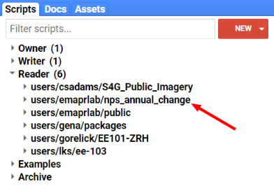
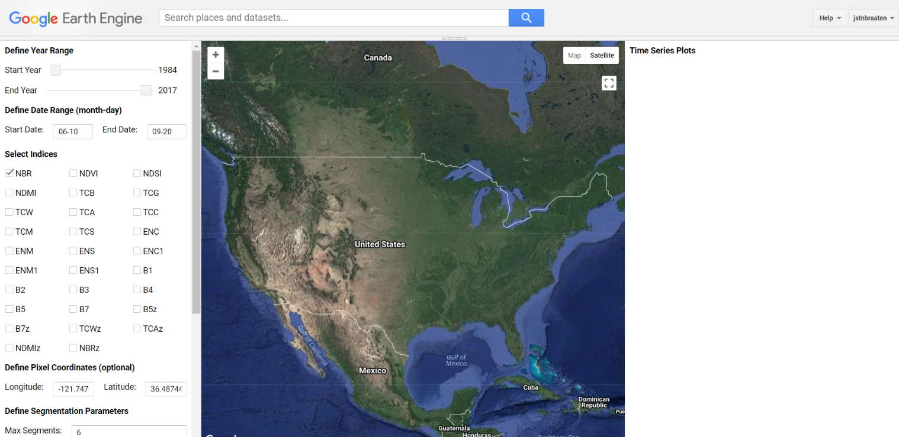
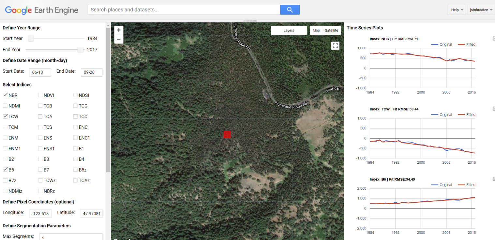
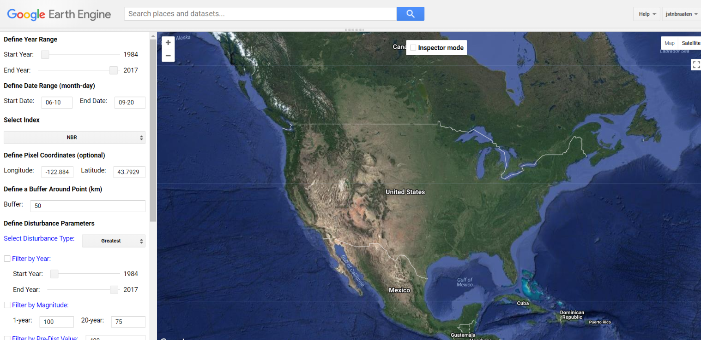

# LandTrendr Parameter Testing
{:.no_toc}

## Table of contents
{:.no_toc .text-delta}

* TOC
{:toc}

GEE has made it possible to pretty quickly do visual assessments of the effect of various LandTrendr 
parameter settings. There are two interfaces for testing and exploring parameters. There is :

1. A time series profile application that shows the results of segmentation for a given pixel time series

2. A greatest disturbance mapping application that shows disturbances for a given set of parameters.

To access these applications make sure that you’ve added the [required repositories](#heading=h.ynfzhje5e82d). 
Open the GEE [IDE](https://code.earthengine.google.com/) and expand the **user/emaprlab/nps_annual_change** 
repository (possible that this name will change). Note that the repo might be under either **Reader or Writer.** 

## 

Expand the repo and you’ll find files: 

1. Get LandTrendr ChangeDB Segmentation Data

2. UI LandTrendr Disturbance Mapper TESTING

3. UI LandTrendr Pixel Time Series Plot TESTING

Clicking on a file will open it in the GEE IDE editor.

## Time Series Segmentation App

The *UI LandTrendr Pixel Time Series Plotter* will plot the Landsat surface reflectance source and 
LandTrendr-fitted index for a selected pixel.  The script is useful for simply exploring and visualizing 
the spectral-temporal space of a location, for comparing the effectiveness of a series of indices for 
identifying landscape change, and for parameterizing LandTrendr to work best for your study region.

Click on the **UI LandTrendr Pixel Time Series Plot TESTING** file. It will open in the GEE IDE editor, 
click the **Run** button

A GUI will populate the Map window of the GEE IDE, drag the top of the Map panel to the top of the IDE 
so that it is as large as possible. It should now look like this:

Here are some instructions for running the application:

1. Click on the script to load it and then click the Run button to initialize the application.

2. Drag the map panel to the top of the page for better viewing.

3. Define a year range over which to generate annual surface reflectance composites.

4. Define the date range over which to generate annual composites. The format is (month-day) with two 
digits for both month and day. Note that if your study area is in the southern hemisphere and you want 
to include dates that cross the year boundary to capture the summer season, this is not possible yet - 
it is on our list!

5. Select [spectral indices and bands](#heading=h.x5i65rpzi1jj) to view. You can select one or many.

6. Optionally define a pixel coordinate set to view the time series of, alternatively you’ll simply 
click on the map. Note that the coordinates are in units of latitude and longitude formatted as decimal 
degrees (WGS 84 EPSG:4326). Also note that when you click a point on the map, the coordinates of the 
point will populate these entry boxes.

7. Define the LandTrendr segmentation parameters. See the 
[LT Parameters](https://docs.google.com/document/d/1MuYjttWOZvqWPAz2BQvr6IPE7N4r9dxW2PuKJoSpxe4/edit#heading=h.w7mtxeya9mfh) section for definitions.

8. Either click a location on the map or hit the Submit button. If you want to change anything about 
the run, but keep the coordinate that you clicked on, just make the changes and then hit the Submit 
button - the coordinates for the clicked location are saved to the pixel coordinates input boxes.

Wait a minute or two and plots of source and LandTrendr-fitted time series data will appear for all the 
indices you selected. The next time you click a point or submit the inputs, any current plots will be 
cleared and the new set will be displayed.

Here we see forest decline near on Hurricane Ridge in Olympic National Park from three different indices

## 

Try different combinations of parameters on points of interest, save screenshots showing parameters 
and LT fits and compare them to find the best parameters and index for your project.

## Greatest Disturbance Mapping App

The *UI LandTrendr Disturbance Mapper* will display map layers of disturbance attributes including: 
year of disturbance detection, magnitude of disturbance, duration of disturbance, and pre-disturbance spectral value.

Click on the **UI LandTrendr Disturbance Mapper TESTING** file. It will open in the GEE IDE editor, 
click the **Run** button

A GUI will populate the Map window of the GEE IDE, drag the top of the Map panel to the top of the IDE 
so that it is as large as possible. It should now look like this:

Here are some instructions for running the application:

1. Click on the script to load it and then click the Run button to initialize the application.

2. Drag the map panel to the top of the page for better viewing.

3. Define a year range over which to identify disturbances - best to set this close to the maximum range, 
you can filter disturbances by year in a different setting below.

4. Define the date range over which to generate annual composites. The format is (month-day) with two 
digits for both month and day Note that if your study area is in the southern hemisphere and you want 
to include dates that cross the year boundary to capture the summer season, this is not possible yet - it is on our list!

5. Select [spectral index or band](#heading=h.x5i65rpzi1jj) to use for disturbance detection.

6. Optionally define a pixel coordinate set to define the center of the disturbance map, alternatively 
you’ll simply click on the map. Note that the coordinates are in units of latitude and longitude formatted as decimal degrees (WGS 84 EPSG:4326). Also note that when you click a point on the map, the coordinates of the point will populate these entry boxes.

7. Define a buffer around the center point defined by a map click or provided in the latitude and longitude 
coordinate boxes from step 6. The units are in kilometers. It will draw and clip the map to the bounds of 
the square region created by the buffer around the point of interest.

8. Define the disturbance type you are interested in - this applies only if there are multiple disturbances 
in a pixel time series. It is a relative qualifier among a series of disturbances for a pixel time series.

9. Optionally filter disturbances by the year of detection. Adjust the sliders to constrain the results to 
a given range of years. The filter is only applied if the Filter by Year box is checked.

10. Optionally filter disturbances by magnitude. Magnitude filtering is achieved by interpolation of a 
magnitude threshold from 1 year to 20 years. Define the magnitude threshold considered a disturbance 
for disturbances that are one year in duration and also 20 years in duration. If you want to apply the 
same threshold value across all durations, enter the same value in each box. The values should be the 
minimum spectral delta value that is considered a disturbance. They should be the absolute value and 
multiplied by 1000 for decimal-based surface reflectance bands and spectral indices (we multiply all 
the decimal-based data by 1000 so that we can convert the data type to signed 16-bit and retain some 
precision). The filter is only applied if the Filter by Magnitude box is checked.

11. Optionally filter by pre-disturbance spectral value. This filter will limit the resulting disturbances 
by those that have a spectral value prior to the disturbance either greater/less than (depending on index) 
or equal to the defined value. The units are a of the spectral index selected for segmentation and should 
be scaled by 1000 (if you are you only want disturbances that had an NBR value of 0.4 prior to disturbance, 
you would set this parameter to 400). The filter is only applied if the Filter by Pre-Dist Value box is checked.

12. Optionally filter by a minimum disturbance patch size, as defined by 8-neighbor connectivity of pixels 
having the same disturbance year of detection. The value is the minimum number of pixel in a patch. The 
filter is only applied if the Filter by MMU box is checked.

13. Define the LandTrendr segmentation parameters. See the 
[LT Parameters](https://docs.google.com/document/d/1MuYjttWOZvqWPAz2BQvr6IPE7N4r9dxW2PuKJoSpxe4/edit#heading=h.w7mtxeya9mfh) section for definitions.

Inspector mode selector. In the center top of the map there is a check box for whether to interact with 
the map in Inspector mode or not. When inspector mode is activated, map clicks engage the GEE Inspector 
functionality so that you can explore map layer values for a point (see the Inspector tab). When deactivated, 
a map click will start mapping disturbances for the region surrounding the clicked point.
