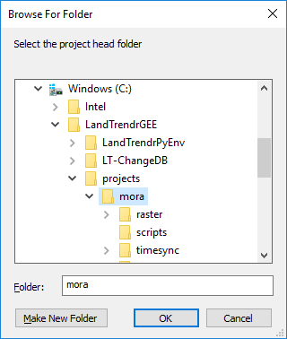
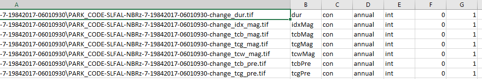
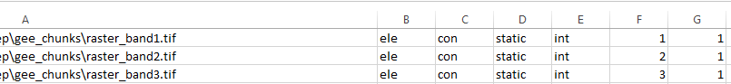
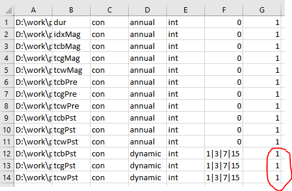
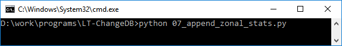

# Generate Annual Change Polygons
{:.no_toc}

## Table of contents
{:.no_toc .text-delta}

* TOC
{:toc}

## Unpack Data from GEE

Open **LandTrendrPyEnv Prompt** by double clicking on the **Start_LandTrendrPyEnv.bat file** in the **LT-ChangeDB folder**.

```
C:\LandTrendrGEE\LT-ChangeDB
    Start_LandTrendrPyEnv.bat
```

Type python in the prompt followed by a space and then drag in the **04_unpack_lt_ee_data.py ** file* *from the 
**LT-ChangeDB folder** or type: 04 followed by the tab key to autocomplete find the file. The command should look like this:

Example of autocomplete:

```console
C:\LandTrendrGEE\LT-ChangeDB>python 04_unpack_lt_ee_data.py
```


Example of script path drag and drop

```console
C:\LandTrendrGEE\LT-ChangeDB>python C:\LandTrendrGEE\LT-ChangeDB\04_unpack_lt_ee_data.py
```


Hit enter and you’ll be asked to navigate to the project head folder select the folder:


> C:\LandTrendrGEE\LT-ChangeDB\projects\mora	*(project head folder)*




After selecting a folder, the program will work to unpack all data downloaded from Google Drive. The command prompt will look like this:

```
C:\LandTrendrGEE\LT-ChangeDB>python 04_unpack_lt_ee_data.py

Working on LT run: PARK_CODE-MORA-NBRz-7-19852017-06010930-v01
   Unpacking file:
      PARK_CODE-MORA-NBRz-7-19852017-06010930-v01-vert_yrs.tif
      PARK_CODE-MORA-NBRz-7-19852017-06010930-v01-vert_fit_idx.tif
      PARK_CODE-MORA-NBRz-7-19852017-06010930-v01-seg_rmse.tif
      PARK_CODE-MORA-NBRz-7-19852017-06010930-v01-ftv_tcb.tif
      PARK_CODE-MORA-NBRz-7-19852017-06010930-v01-ftv_tcg.tif
      PARK_CODE-MORA-NBRz-7-19852017-06010930-v01-ftv_tcw.tif
   Unpacking file:
      PARK_CODE-MORA-NBRz-7-19852017-06010930-v01-clear_pixel_count.tif
   Creating TC ftv delta data
      PARK_CODE-MORA-NBRz-7-19852017-06010930-v01-ftv_tcb_delta.tif
      PARK_CODE-MORA-NBRz-7-19852017-06010930-v01-ftv_tcg_delta.tif
      PARK_CODE-MORA-NBRz-7-19852017-06010930-v01-ftv_tcw_delta.tif
   Creating TC vert_fit data
      100% done
Done!
LT-GEE data unpacking took 4.8 minutes
```


The unpacked files will be placed in several subfolders of the project head folder. Files and 
some subfolders are named according to the file name given to the GEE output files 
([File name description key](#heading=h.cikfk8fyn4aq)), excluding the projection. The major 
file types unpacked in the is step include: 

- **Run info file**: this is a .txt file that is placed directly inside the project head 
folder. It describes the LandTrendr run and includes all of the parameters used, as well 
as a list of all the images used to build the annual surface reflectance composites.

- **Segmentation files**: this set of files is unpacked into a subfolder of the 
*<project head>\raster\landtrendr\segmentation folder. They are output files from LandTrendr. 
Please see the [Segmentation Raster File Names and Definitions](#heading=h.no6fp058un2h) 
section for detail about the files. 

- **Vector file**: A shapefile that defines the boundary of the area run by LandTrendr 
is placed inside of the *<project head>\vector folder. If the shapefile you uploaded to 
GEE contained more than one feature, this shapefile will only include the feature defined 
by the key-value pair given in the LandTrendr parameters and will be buffered by 300m to 
account for changes that occur at the boundary. 

- **TimeSync files**: If you chose to export TimeSync files from GEE, then the unpacking 
script will move the TimeSync image files to the *<project head>\timesync\prep folder. 
It does not process them in this step, it simply moves them. It also places a shapefile 
in the *<project head>\timesync\vector folder. If the shapefile you uploaded to GEE contained 
more than one feature, this shapefile will only include the feature defined by the key-value 
pair given in the LandTrendr parameters. It represents the extent of the feature with a buffer 
6300m to account the size of TimeSync image chip.

What to do with the packaged LT-GEE files in the prep folder - the plan was to delete them after 
unpacking - do park folks want to archive them to an "~ltgeearchive" folder? 

## Extract Annual Change as Rasters

Type python in the prompt followed by a space and then drag in the **05_extract_annual_change.py file** 
from the **LT-ChangeDB folder** or type: `05` followed by the tab key to autocomplete find the file. 
The command should look like this:

Example of autocomplete:

```console
C:\LandTrendrGEE\LT-ChangeDB>python 05_extract_annual_change.py
```


Example of script path drag and drop

```console
C:\LandTrendrGEE\LT-ChangeDB>python C:\LandTrendrGEE\LT-ChangeDB\05_extract_annual_change.py
```

After hitting the enter key, a Windows Explorer popup will appear prompting you to "Select the 
project head folder". The prompt should default to the top of all open application windows. 
If it doesn’t, minimize other open windows until you see it.

Generic example directory path to "project head folder"

```
C:\LandTrendrGEE
├───LandTrendrPyEnv
├───LT-ChangeDB
└───projects
    └───<project head folder>
```


Example path following the "mora" demo

```console
C:\LandTrendrGEE\LT-ChangeDB\projects\mora
```


After Selecting the project head folder the program will identify the LandTrendr run associated with the project, 
display its name and ask whether you would like to vegetation disturbance or growth. Type either **disturbance** or 
**growth** and hit enter.

Here is what is shown in the command prompt

```console
Regarding LT run: NBR-9-19842017-06010930-v01
What change do you want to map (disturbance or growth)?:
```


Next you’ll be asked to provide a minimum disturbance threshold. The value will depend on what spectal index was used 
in LandTrendr segmentation. If the index was a normalized band difference, like NBR or NDVI, where natural range is -1 to 1,
then multiple a desired minimum delta by 1000 (ie 125 is generally good for NBR). If the index was a z-score index like NBRz
the units are expressed as standard deviations from from mean of time series times 1000. In this case you'd want to set the minimum 
magnitude threshold at least a little outside of 1 standard deviation (~1250 is good for NBRz).  
You might also want to set a threshold relative to a given pixels average variability around the line of segmentation. This is
considered a DSNR units and work work any index (1.25-1.35 is good for NBR)

TODO: these still need more description and explanation


```
Regarding LT run: NBR-9-19842017-06010930-v01
What is the desired minimum change magnitude:
```

Next you'll be asked to specify the units - whether the previously provided magnitude threshold is *Change Signal to Noise Ration* or not: 

```console
Regarding LT run: NBR-9-19842017-06010930-v01
Is the minimum change magnitude unit DSNR? (yes or no):
```

Next you'll specify whether you want to collapse consecutive change segment into one segment:

TODO: needs more description and explanation - include the graphic somewhere about determining the value to use

```console
Regarding LT run: NBR-9-19842017-06010930-v01
Consecutive change segment collapse threshold (0 to ignore):
```

The progress will print to the console

```
Working on LT run: NBR-9-19842017-06010930-v01
   38% done
```


The annual change rasters will be placed within a subfolder of the *<project_head>\raster\landtrendr\segmentation folder 
with the name equal to the LT-GEE job name plus the change type and the minimum magnitude threshold value, for example: 
NBR-9-19842017-06010930-v01-LOSSVEG_DSNR_1.35-col_0.0

These files are all related to the LandTrendr segmentation and fitting to vertex processes.

```
Project Head
└───raster
    └───landtrendr
        └───change\<job>\
			NBR-9-19842017-06010930-v01-vloss_dsnr_1.35-col_0.0-change_attributes.csv
			NBR-9-19842017-06010930-v01-vloss_dsnr_1.35-col_0.0-change_dur.tif
			NBR-9-19842017-06010930-v01-vloss_dsnr_1.35-col_0.0-change_idx_mag.tif
			NBR-9-19842017-06010930-v01-vloss_dsnr_1.35-col_0.0-change_tcb_mag.tif
			NBR-9-19842017-06010930-v01-vloss_dsnr_1.35-col_0.0-change_tcb_post.tif
			NBR-9-19842017-06010930-v01-vloss_dsnr_1.35-col_0.0-change_tcb_pre.tif
			NBR-9-19842017-06010930-v01-vloss_dsnr_1.35-col_0.0-change_tcg_mag.tif
			NBR-9-19842017-06010930-v01-vloss_dsnr_1.35-col_0.0-change_tcg_post.tif
			NBR-9-19842017-06010930-v01-vloss_dsnr_1.35-col_0.0-change_tcg_pre.tif
			NBR-9-19842017-06010930-v01-vloss_dsnr_1.35-col_0.0-change_tcw_mag.tif
			NBR-9-19842017-06010930-v01-vloss_dsnr_1.35-col_0.0-change_tcw_post.tif
			NBR-9-19842017-06010930-v01-vloss_dsnr_1.35-col_0.0-change_tcw_pre.tif
			NBR-9-19842017-06010930-v01-vloss_dsnr_1.35-col_0.0-change_yrs.tif
```
			
See the Appendix for definitions of the files

## Make Polygons from Annual Rasters

Type python in the prompt followed by a space and then drag in the **06_make_polygons.py file*** *from the **LT-ChangeDB folder** 
or type: 06 followed by the tab key to autocomplete find the file. The command should look like this:

Example of autocomplete:

```console
C:\LandTrendrGEE\LT-ChangeDB>python 06_make_polygons.py
```


Example of script path drag and drop

```console
C:\LandTrendrGEE\LT-ChangeDB>python C:\LandTrendrGEE\LT-ChangeDB\python 06_make_polygons.py
```


After hitting the enter key, a Windows Explorer popup will appear prompting you to "Select the project head folder". 
The prompt should default to the top of all open application windows. If it doesn’t, minimize other open windows until you see it.

Generic example directory path to "project head folder"

```
C:\LandTrendrGEE
├───LandTrendrPyEnv
├───LT-ChangeDB
└───projects
    └───<project head folder>
```

Example path following the "mora" demo

```
C:\LandTrendrGEE\LT-ChangeDB\projects\mora</td>
```


After you select the project head folder you’ll be presented with a list of raster change definitions that were generated 
in the previous step. You be asked to select which one to convert to polygons. Enter the number to the left of the change 
definition you want to convert.

```
Here is the list of raster change definitions:
1: NBR-9-19842017-06010930-v01-vloss_dsnr_1.35-col_0.0

Which one would you like to convert to polygons (enter the number):
```

Next you’ll be asked to provide a minimum mapping unit. The value is the minimum number of connected pixels that define a 
patch (neighbor rule defined in next step). If you select 10, then patches with < 10 pixels will be ignored in conversion 
from raster to vector. We recommend using a MMU between 5-10 (9 is one hectare). You’ll likely want to try a few sizes to 
see what represents your landscape better and is a compromise between commission and omission error. 

```
Regarding raster change definition: NBR-9-19842017-06010930-v01-vloss_dsnr_1.35-col_0.0
What is the desired minimum mapping unit in pixels per patch:
```

Next you’ll be asked to define the connectivity rule - 8 neighbor or 4 neighbor. If you want 8 neighbor type yes - if not type no

```
Regarding raster change definition: NBR-9-19842017-06010930-v01-vloss_dsnr_1.35-col_0.0
Should diagonal adjacency warrant pixel inclusion in patches? - yes or no:
```


Progress will be printed

```
Working on raster change definition: NBR-9-19842017-06010930-v01-vloss_dsnr_1.35-col_0.0
    sieving to minimum mapping unit...
    making polygons from disturbance pixel patches...
        working on year: 1/32 (1986)
        working on year: 2/32 (1987)
        working on year: 3/32 (1988)
        working on year: 4/32 (1989)
        working on year: 5/32 (1990)
        working on year: 6/32 (1991)
        working on year: 7/32 (1992)
        working on year: 8/32 (1993)
        working on year: 9/32 (1994)
```


The annual disturbance polygons will be placed within a sub-folder of the project_head\vector\change folder 
with the name equal to the LT-GEE job name. 

```
C:\LandTrendrGEE\LandTrendrPyEnv\projects\<project head folder>
└───vector
    └───change
        └───NBR-9-19842017-06010930-v01-vloss_dsnr_1.35-col_0.0-11mmu_8con
                _change_merged.dbf
                _change_merged.prj
                _change_merged.shp
                _change_merged.shx
                attributes.csv
                change_1986.dbf
                change_1986.prj
                change_1986.shp
                change_1986.shx
                change_1987.dbf
                change_1987.prj
                change_1987.shp
                change_1987.shx
                ...remaining years
                patches.tif
```


### Polygon Attributes

In step 5 (script 05_extract_annual_change.py)  an *attributes.csv file was created and populated with a 
standard set of variables to summarize per polygon. This file was copied to the <head folder>\vector\<run name> dir. 
We can edit this file (either the source one or the one that was just copied) to either turn variable to be 
summarized off and on or add more variables to be summarized, like elevation, slope, ave precip, soil type, etc. 
More information about this file can be found in the [appendix](#heading=h.g06pygirthjs).

## Adding Attributes from other rasters

You can add other raster data (DEM, Slope, etc.) to the attributes of your polygons by following the steps laid out below.

1. First, Download and add your TIF file to <directory header>/raster/prep/gee_chucks" 

* You can download as dem from Google Earth Engine under reader as get DEM.

2. Then go to <Project header>\raster\landtrendr\change\<job> where there is an Excel file. Open the excel 
file and it will look something like this.	

 

3. In column A add the file path to the TIF file you added in step 1

4. In column B add the name that you want to represent that field. (for a DEM use Elev for elevation 
or IR for infrared reflectance.)

5. In column C add "con". 

6. In column D add "static".

7. In column E add "int"

8. In column F add the band number for the raster being used. If the raster has more than one band and 
you would like to add the attributes from the other bands to the polygons repeat steps 1 through 9 for each band. (example below)



9. In column G and a "1" or “0” to turn the attribute on or off. If it is off it will not be added.

10. Once your done adding information to the table **SAVE **your changes and close the excel file and continue on.

## When Testing Do this section

Open the file that is similar to this on you system/project:

PROJECT HEAD FOLDER\vector\change\PARK_CODE-MORA-NBRz-7-19842017-06010930-dist_info_11mmu_8con\PARK_CODE-MORA-NBRz-7-19842017-06010930-change_attributes.csv

You can open it in Excel or a programming-friendly text editor (Justin uses notepad++)



Change the red circled 1’s to 0s and save the file (keep format as csv). This file controls how what is summarized 
for polygons. This 7th column is an on/off switch, we’re going to turn off summarizing these three attributes because 
they take hours to complete.

## Append Zonal Statistics to Polygons

Type python in the prompt followed by a space and then drag in the *07_append_zonal_stats.py*  file* *from the 
*LT-ChangeDB *folder or type: 07 followed by the tab key to autocomplete find the file. The command should look like this:



Example: >python 07_append_zonal_stats.py (if autocomplete worked)

...or

Example: >python D:\work\programs\LT-ChangeDB\07_append_zonal_stats.py

Hit enter and you’ll be asked to navigate to the project head folder.

You will get an error that can be ignored - does not affect the outputs:

```
*rasterstats\main.py:161: FutureWarning: Conversion of the second argument of issubdtype from `float` to `np.floating` is deprecated.
```


The polygon files created in the previous step will be updated to include zonal summary stats for various attributes and two 
new files that are will be created, which are all of the individual year polygons merged into a single shapefile and a 
single spatialite geodatabase file  

```
Project Head
└───vector\change\<job>
		distall.dbf
		distall.prj
		distall.shp
		distall.shx

Project Head
└───vector\change\<job>
	distall.sqlite
