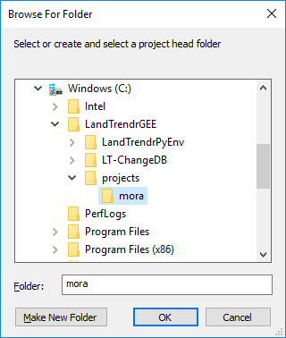

# Project Setup
{:.no_toc}

## Table of contents
{:.no_toc .text-delta}

* TOC
{:toc}

## About

You need to create a new project directory for each discrete geographic region you want to assemble change data for. 
The **Project Directory folder** will hold a series of subfolders that are created by a python script where all of the data 
from Earth Engine will go, as well the data generated from post-processing scripts. You can create this project 
folder anywhere on your system. For consistency in this guide, it will be placed inside the **LandTrendrGEE** folder 
that was described in the **[Directory Setup](https://emapr.github.io/LT-ChangeDB/docs/directory_setup.html)** section.

## Create Project Directory

1. Make a new folder on your system to hold **LT-ChangeDB** post-processing files. In this example, I make a parent **projects** folder in the **LandTrendrGEE** folder that will hold a series of separate regions. I manually create a new folder called **projects **and a subfolder for a project called **mora** (Mount Rainier). The following diagram shows my current directory structure - the bolded folders were just created.

```
C:\LandTrendrGEE
├───LandTrendrPyEnv
├───LT-ChangeDB
└───projects
    └───mora
```


1. Create the project directory structure. Open **LandTrendrPyEnv Prompt** by double clicking on the **Start_LandTrendrPyEnv.bat** file in the **LT-ChangeDB*** *folder.

Type python in the prompt followed by a space and then type 02 and hit the tab key to autocomplete the filename. If the file was not found by autocomplete, then drag in the **02_project_setup.py*** *file from the **LT-ChangeDB*** *folder. The command should look like this:

Example of autocomplete:

```
C:\LandTrendrGEE\LT-ChangeDB>python 02_preoject_setup.py
```

Example of script path drag and drop

```
C:\LandTrendrGEE\LT-ChangeDB>python C:\LandTrendrGEE\LT-ChangeDB\02_preoject_setup.py
```


After hitting the enter key, a Windows Explorer popup will appear prompting you to "Select or create and select a project head folder" that will hold all the raster and vector data for a specific study area. The prompt should default to the top of all open applications windows. If it doesn’t, minimize other open windows until you see it.

2. Navigate to the project folder, select it and press the OK button.

[//]: # ()

The program will then generate a directory structure in the head project folder you selected that looks like this:

```
Project Head (C:\LandTrendrGEE\projects\mora)
├───raster
│   ├───landtrendr
│   │   ├───change
│   │   └───segmentation
│   └───prep
│       └───gee_chunks
├───scripts
├───timesync
│   ├───prep
│   ├───raster
│   └───vector
├───vector
└───video
```

In the following steps these folders will be filled with files manually and automatically from Python scripts.  