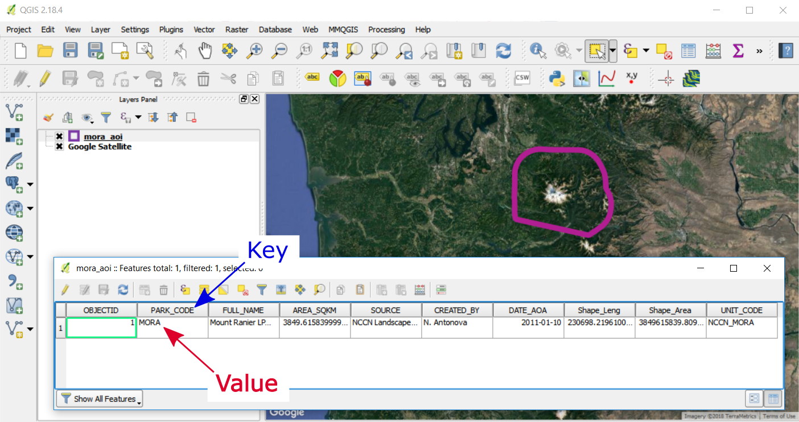
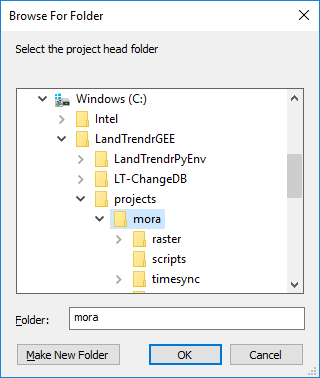
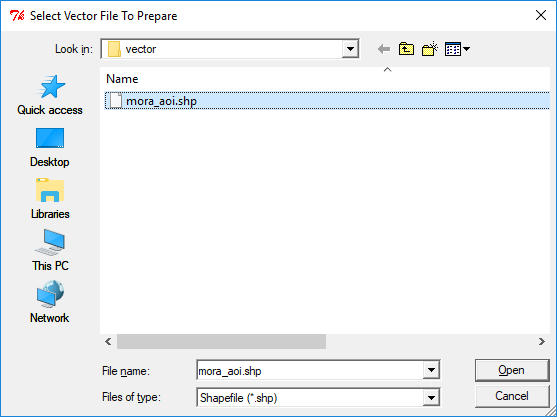

# Vector Setup
{:.no_toc}

## Table of contents
{:.no_toc .text-delta}

* TOC
{:toc}

## About

In this step you’ll run a script to standardize an existing vector file that defines the boundary of your study area. The script will automatically create a new ESRI Shapefile projected to EPSG:4326 (WGS84 Lat Long) and zips it up with all the .shp sidecar files (.dbf, .prj, .shx). This zipped shapefile will be uploaded to Google Earth Engine and define the region that LandTrendr is run on.

The vector file that you use can have a single feature (like a single park boundary) or multiple features (all park boundaries for a given network). In any case, each study region needs to be identifiable by a unique ID for a given attribute (we’ll refer to this as a key-value pair). In the vector file that I’m using for the demo, I have a single boundary for Mount Rainier. The **Key** attribute is "PARK_CODE" and the **Value** for the feature of interest is “MORA”  

Google Earth Engine will want a "key-value" pair to know what feature in the vector should be analyzed by LandTrendr. It is important that both the Key and the Value not have hyphens (-), underscores are fine. Hyphens are a reserved character for use in filename parsing in LT-ChangeDB scripts. The key and value of the feature in this project will appear in file names, so if there is a hyphen in either the Key or the Value, then the system will break. Before moving on make sure that you have an area of interest file that meets the requirements described here. Once you have a shapefile with a unique ID defined by a Key (attribute field name) and Value (attribute value for a given feature) then move to creating a version for use in Google Earth Engine.

## Create a Google Earth Engine AOI File

1. Move the area of interest (AOI) shapefile (described previously) and all of its associated files to the "**vector**" folder within your project head folder created in the previous [Project Setup](#heading=h.qtiyguaspsr0) section. 

<table>
  <tr>
    <td>Project Head (mora)
├───raster
│   ├───landtrendr
│   │   ├───change
│   │   └───segmentation
│   └───prep
│       └───gee_chunks
├───scripts
├───timesync
│   ├───prep
│   ├───raster
│   └───vector
├───vector
└───video</td>
  </tr>
</table>

1. Open **LandtrendrPyEnv prompt** and type python then leave a space and then drag in the file **03_vector_setup.py*** *or autocomplete on 03* *and hit enter to run the script

Example of autocomplete:

<table>
  <tr>
    <td>C:\LandTrendrGEE\LT-ChangeDB>python 03_vector_setup.py</td>
  </tr>
</table>

Example of script path drag and drop

<table>
  <tr>
    <td>C:\LandTrendrGEE\LT-ChangeDB>python C:\LandTrendrGEE\LT-ChangeDB\03_vector_setup.py</td>
  </tr>
</table>

A Windows Explorer prompt will appear requesting that you select the project head folder

Navigate to the head project directory, select it and hit the OK button

A second prompt will appear listing available *.shp files in the vector directory and requests that you select a *.shp file to prepare for GEE. Select the *.shp file that you want to represent the area of interest for this project.

The program will create a new shapefile that appends some information to the end of the original file name and then zips a copy for upload to Google Earth Engine. See the bolded files below. The zipped file (*.zip) will be uploaded to Google Earth Engine in a following step.

<table>
  <tr>
    <td>Project Head (mora)
├───raster
├───scripts
├───timesync
├───vector
│       mora_aoi.dbf
│       mora_aoi.prj
│       mora_aoi.shp
│       mora_aoi.shx
│       mora_aoi_ltgee.zip
│       mora_aoi_ltgee_epsg4326.dbf
│       mora_aoi_ltgee_epsg4326.prj
│       mora_aoi_ltgee_epsg4326.shp
│       mora_aoi_ltgee_epsg4326.shx
│
└───video</td>
  </tr>
</table>
