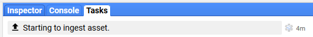

# Vector Upload to Google Earth Engine
{:.no_toc}

## Table of contents
{:.no_toc .text-delta}

* TOC
{:toc}

In the previous [Vector Setup](#heading=h.7ncjbx4zupdj) step we generated a zipped directory of a shapefile 
that defines the region of this project. Now we’ll upload that file as an asset to your GEE account so it can be used to define the area that LandTrendr should be run on. 

GEE User Guide reference for importing vectors:

[https://developers.google.com/earth-engine/importing](https://developers.google.com/earth-engine/importing)

## Instructions

1. If not already open, open the GEE IDE: [https://code.earthengine.google.com/](https://code.earthengine.google.com/). 
If not already signed in, you’ll be prompted to log in to your GEE account. 

1. Once the IDE opens click on the **Assets** tab in the left panel to open the **Assets Manager**. 
If you’ve not uploaded assets previously, then you’ll be prompted to **Create Home Folder**

Click the button and you’ll be presented with a new window where you are to define the name of the home folder. 
I would provide the same name as your user name in the **Scripts** library. For instance the eMapR user name is "emaprlab" (from: *users/***_emaprlab_***/default)* so I entered “emaprlab” as my asset home folder. This is just for consistency - it doesn’t matter that much. Here is an example from Al Kirschbaum:* *

1. If you’ve just set up your GEE **Assets** folder, or it already exists, you should be able to Click the 
**New** button to release a drop down menu and then select **Table upload**

1. Select the .zip file from vector subfolder of the head project directory

Optionally rename the file and hit OK

An **Asset Ingestion** job, which can be monitored in the **Task Manager** found under the **Tasks** tab in 
the right panel of the GEE IDE, will start. If you don’t see the job, you may have to refresh the browser. 
In a few minutes the process should complete and you will see your region in the **Asset Manager** panel - if 
you don’t see it after the job completes, then refresh the assets and/or the browser.

Job starts:

Asset upload and ingestion completes:

If you get an error, contact Justin Braaten at jstnbraaten@gmail.com